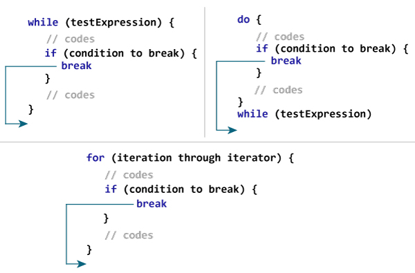
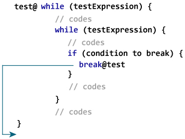

# Kotlin 打破表情

> 原文： [https://www.programiz.com/kotlin-programming/break](https://www.programiz.com/kotlin-programming/break)

#### 在本教程中，您将学习使用 break 终止循环。 此外，您还将了解中断标签。

假设您正在使用循环。 有时希望不检查测试表达式就立即终止循环。

在这种情况下，将使用`break`。 遇到时，它将终止最近的封闭循环（无需检查测试表达式）。 这类似于 [break 语句在 Java](/java-programming/break-statement "Java break Statement") 中的工作方式。

* * *

## 中断如何工作？

if..else 构造几乎总是与[一起使用。 例如，](/kotlin-programming/if-expression "Kotlin if...else")

```kt
for (...) {
    if (testExpression) {
        break
    }
}
```

如果将`testExpression`评估为`true`，则将执行`break`，从而终止`for`循环。



* * *

### 范例：Kotlin 中断

```kt
fun main(args: Array<String>) {

    for (i in 1..10) {
        if (i == 5) {
            break
        }
        println(i)
    }
}
```

运行该程序时，输出为：

```kt
1
2
3
4

```

当`i`的值等于 5 时，将`if`内部的表达式`i == 5`评估为`true`，并执行`break`。 这终止了循环的[。](/kotlin-programming/for-loop "Java for Loop")

* * *

### 示例：计算总和，直到用户输入 0

下面的程序计算用户输入的数字总和，直到用户输入 0。

访问 [Kotlin 基本输入输出](/kotlin-programming/input-output)，以了解有关如何从用户那里获取输入的更多信息。

```kt
fun main(args: Array<String>) {

    var sum = 0
    var number: Int

    while (true) {
        print("Enter a number: ")
        number = readLine()!!.toInt()

        if (number == 0)
            break

        sum += number
    }

    print("sum = $sum")
}
```

When you run the program, the output will be:

```kt
Enter a number: 4
Enter a number: 12
Enter a number: 6
Enter a number: -9
Enter a number: 0
sum = 13
```

在上面的程序中，`while`循环的测试表达式始终为`true`。

在此，`while`循环一直运行到用户输入 0 为止。当用户输入 0 时，将执行`break`，从而终止`while`循环。

* * *

## Kotlin 标记的休息

到目前为止，您所学到的是`break`的未标记形式，它终止了最近的封闭循环。 还有另一种方式可以使用`break`（标记形式）终止所需的循环（可以是外部循环）。

* * *

### 标记的中断如何工作？

### 

Kotlin 中的标签以[标识符](/kotlin-programming/keywords-identifiers#identifiers "Kotlin identifier")开头，后跟`@`。

此处，`test @`是在循环时在外部[处标记的标签。 现在，通过在标签上使用`break`（在这种情况下为`break@test`），可以中断特定的循环。](/kotlin-programming/while-loop "Kotlin while Loop")

这是一个示例：

```kt
fun main(args: Array<String>) {

    first@ for (i in 1..4) {

        second@ for (j in 1..2) {
            println("i = $i; j = $j")

            if (i == 2)
                break@first
        }
    }
}
```

When you run the program, the output will be:

```kt
i = 1; j = 1
i = 1; j = 2
i = 2; j = 1
```

在此，当将`i == 2`表达式评估为`true`时，将执行`break@first`，从而终止标记为`first@`的循环。

* * *

这是上述程序的一些变体。

在下面的程序中，break 终止带有标签`@second.`的循环

```kt
fun main(args: Array<String>) {

    first@ for (i in 1..4) {

        second@ for (j in 1..2) {
            println("i = $i; j = $j")

            if (i == 2)
                break@second
        }
    }
}

```

When you run the program, the output will be:

```kt
i = 1; j = 1
i = 1; j = 2
i = 2; j = 1
i = 3; j = 1
i = 3; j = 2
i = 4; j = 1
i = 4; j = 2
```

**注意**：由于`break`用于终止该程序中的最内层循环，因此在这种情况下不必使用带标签的中断。

* * *

Kotlin 中有 3 个结构跳转表达式：`break`，`continue`和`return`。 要了解`continue`和`return`表达，请访问：

*   *Kotlin 继续*
*   *Kotlin 功能*