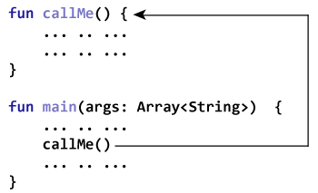
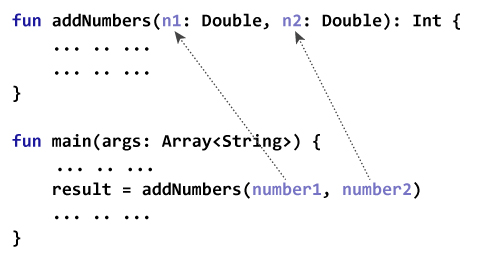
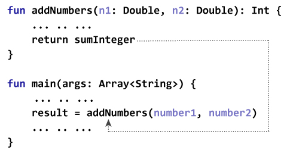

# Kotlin 函数

> 原文： [https://www.programiz.com/kotlin-programming/functions](https://www.programiz.com/kotlin-programming/functions)

#### 在本文中，您将学习函数。 什么是函数，其语法以及如何在 Kotlin 中创建用户函数。

在编程中，函数是一组执行特定任务的相关语句。

函数用于将大型程序分解为较小的模块化块。 例如，您需要根据用户的输入来创建圆圈并为其着色。 您可以创建两个函数来解决此问题：

*   `createCircle()`函数
*   `colorCircle()`函数

将复杂的程序划分为较小的组件可以使我们的程序更有条理和更易于管理。

此外，它避免了重复，并使代码可重用。

* * *

## 函数类型

根据用户定义的函数还是[标准库](https://kotlinlang.org/api/latest/jvm/stdlib/ "Kotlin standard Library")中可用的函数，有两种类型的函数：

*   Kotlin 标准库函数
*   用户定义的函数

* * *

### Kotlin 标准库函数

标准库函数是 Kotlin 中的内置函数，可以随时使用。 例如，

*   `print()`是一种库函数，可将消息打印到标准输出流（监视器）。
*   `sqrt()`返回数字的平方根（`Double`值）

```kt
fun main(args: Array<String>) {

    var number = 5.5
    print("Result = ${Math.sqrt(number)}")
}
```

运行该程序时，输出为：

```kt
Result = 2.345207879911715
```

这是 [Kotlin 标准库](https://kotlinlang.org/api/latest/jvm/stdlib/ "Kotlin Standard Library")的链接，供您浏览。

* * *

### 用户定义的函数

如前所述，您可以自己创建函数。 这些函数称为用户定义函数。

* * *

### 如何在 Kotlin 中创建用户定义的函数？

在使用（调用）函数之前，需要对其进行定义。

在 Kotlin 中定义函数的方法如下：

```kt
fun callMe() {
    // function body
}

```

要在 Kotlin 中定义函数，请使用`fun`关键字。 然后是函数的名称（[标识符](/kotlin-programming/keywords-identifiers#identifiers "Kotlin identifiers")）。 在此，函数的名称为`callMe`。

在上述程序中，括号`( )`为空。 这意味着此函数不接受任何参数。 您将在本文的后面部分了解参数。

花括号`{ }`中的代码是该函数的主体。

* * *

### 如何调用函数？

您必须调用该函数才能在函数体内运行代码。 这是如何做：

```kt
callme()
```

该语句调用先前声明的`callMe()`函数。



* * *

### 示例：简单函数的程序

```kt
fun callMe() {
    println("Printing from callMe() function.")
    println("This is cool (still printing from inside).")
}

fun main(args: Array<String>) {
    callMe()
    println("Printing outside from callMe() function.")
}
```

运行该程序时，输出为：

```kt
Printing from callMe() function.
This is cool (still printing from inside).
Printing outside from callMe() function.
```

上面代码中的`callMe()`函数不接受任何参数。

另外，该函数不返回任何值（返回类型为`Unit`）。

让我们来看另一个函数示例。 该函数将接受参数并返回一个值。

* * *

### 示例：使用函数加两个数字

```kt
fun addNumbers(n1: Double, n2: Double): Int {
    val sum = n1 + n2
    val sumInteger = sum.toInt()
    return sumInteger
}

fun main(args: Array<String>) {
    val number1 = 12.2
    val number2 = 3.4
    val result: Int

    result = addNumbers(number1, number2)
    println("result = $result")
}
```

运行该程序时，输出为：

```kt
result = 15
```

* * *

### 带参数和返回值的函数如何工作？

在此，在函数调用期间将类型为`Double`的两个参数`number1`和`number2`传递给`addNumbers()`函数。 这些参数称为实际参数。

```kt
result = addNumbers(number1, number2)
```

参数`n1`和`n2`接受传递的参数（在函数定义中）。 这些参数称为形式参数（或参数）。



在 Kotlin 中，参数之间用逗号分隔。 同样，形式参数的类型必须显式键入。

注意，实际参数和形式参数的数据类型应匹配，即，第一个实际参数的数据类型应与第一个形式参数的类型匹配。 同样，第二个实际参数的类型必须与第二个形式参数的类型匹配，依此类推。

* * *

这里，

```kt
return sumInteger
```

是`return`语句。 该代码终止`addNumbers()`函数，程序控制跳至`main()`函数。

在程序中，从`addNumbers()`函数返回`sumInteger`。 该值分配给变量`result`。



注意，

*   `sumInteger`和`result`均为`Int`类型。
*   函数的返回类型在函数定义中指定。

    ```kt
    // return type is Int
    fun addNumbers(n1: Double, n2: Double): Int {
        ... .. ...
    }
    ```

如果该函数不返回任何值，则其返回类型为`Unit`。 如果返回类型为`Unit`，则可以在函数定义中指定返回类型。

* * *

### 示例：使用函数显示名称

```kt
fun main(args: Array<String>) {
    println(getName("John", "Doe"))
}

fun getName(firstName: String, lastName: String): String = "$firstName $lastName"
```

运行该程序时，输出为：

```kt
John Doe
```

这里，`getName()`函数采用两个`String`参数，并返回`String`。

如果函数返回单个表达式，则可以省略函数主体的花括号`{ }`，并在`=`符号后指定主体（如上述示例）。

在这种情况下，显式声明返回类型是可选的，因为返回类型可以由编译器推断。 在上面的示例中，您可以替换

```kt
fun getName(firstName: String, lastName: String): String = "$firstName $lastName"
```

与

```kt
fun getName(firstName: String, lastName: String) = "$firstName $lastName"

```

* * *

这只是 Kotlin 中函数的简要介绍。 与函数有关的推荐文章：

*   *Kotlin 内联函数*
*   *Kotlin 中缀函数*
*   *Kotlin 函数范围*
*   *Kotlin 默认参数和命名参数*
*   *Kotlin 递归*
*   *Kotlin 尾递归函数*
*   *Kotlin 扩展函数*
*   *Kotlin 高阶函数和 Lambdas*