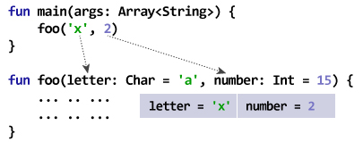
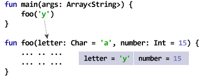
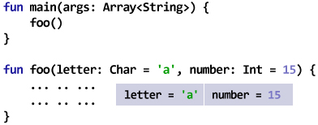
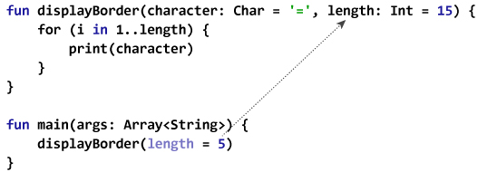

# Kotlin 默认和命名参数

> 原文： [https://www.programiz.com/kotlin-programming/default-named-arguments](https://www.programiz.com/kotlin-programming/default-named-arguments)

#### 在本文中，您将在示例的帮助下了解默认参数和命名参数。

## Kotlin 默认参数

在 Kotlin 中，您可以为函数定义中的参数提供默认值。

如果通过传递的参数调用该函数，则将这些参数用作参数。 但是，如果在不传递参数的情况下调用该函数，则会使用默认参数。

* * *

### 默认参数如何工作？

**情况 I：所有参数均通过**

* * *



函数`foo()`具有两个参数。 参数提供有默认值。 但是，通过在上述程序中传递两个参数来调用`foo()`。 因此，不使用默认参数。

在`foo()`功能内，`字母`和`数字`的值分别为`'x'`和`2`。

**情况 II：未传递所有参数**

* * *



在此，仅一个（第一个）参数传递给`foo()`函数。 因此，第一个参数使用传递给函数的值。 但是，第二个参数`编号`将采用默认值，因为在函数调用期间未传递第二个参数。

在`foo()`功能内，`字母`和`数字`的值分别为`'y'`和`15`。

**情况 III：不传递任何参数**

* * *



在此，不传递任何参数就调用`foo()`函数。 因此，两个参数都使用其默认值。

在`foo()`功能内，`字母`和`数字`的值分别为`'a'`和`15`。

* * *

### 示例：Kotlin 默认参数

```kt
fun displayBorder(character: Char = '=', length: Int = 15) {
    for (i in 1..length) {
        print(character)
    }
}

fun main(args: Array<String>) {
    println("Output when no argument is passed:")
    displayBorder()

    println("\n\n'*' is used as a first argument.")
    println("Output when first argument is passed:")
    displayBorder('*')

    println("\n\n'*' is used as a first argument.")
    println("5 is used as a second argument.")
    println("Output when both arguments are passed:")
    displayBorder('*', 5)

}
```

运行该程序时，输出为：

```kt
Output when no argument is passed:
===============

'*' is used as a first argument.
Output when first argument is passed:
***************

'*' is used as a first argument.
5 is used as a second argument.
Output when both arguments are passed:
*****
```

* * *

## Kotlin 命名论点

在讨论命名参数之前，让我们考虑对上面的代码进行一些修改：

```kt
fun displayBorder(character: Char = '=', length: Int = 15) {
    for (i in 1..length) {
        print(character)
    }
}

fun main(args: Array<String>) {
    displayBorder(5)
}
```

在这里，我们试图将第二个参数传递给`displayBorder()`函数，并使用默认参数作为第一个参数。 但是，此代码将提供使用错误。 这是因为编译器认为我们正在尝试为字符（`Char`类型）提供 5（`Int`值）。

为了解决这种情况，可以使用命名参数。 方法如下：

* * *

### 示例：科特林命名参数

```kt
fun displayBorder(character: Char = '=', length: Int = 15) {
    for (i in 1..length) {
        print(character)
    }
}

fun main(args: Array<String>) {
    displayBorder(length = 5)
}

```

When you run the program, the output will be:

```kt
=====
```

在上面的程序中，我们使用命名参数（`length = 5`）指定函数定义中的`长度`参数应采用此值（与参数的位置无关）。



第一个参数`字符`使用程序中的默认值`'='`。