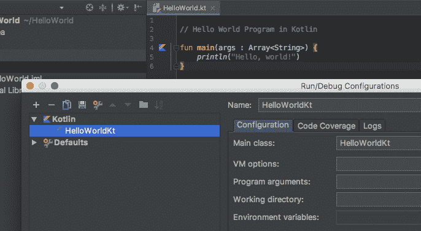
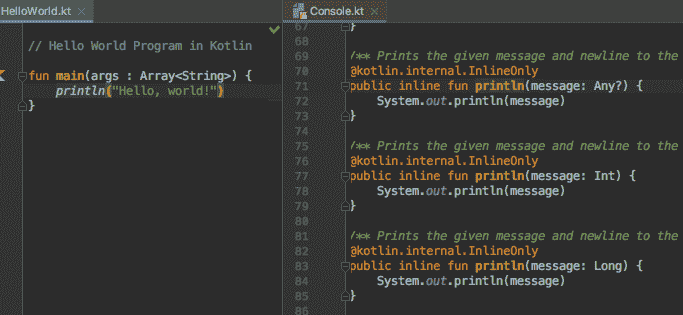

# Kotlin HelloWorld - 您的 Kotlin 程序

> 原文： [https://www.programiz.com/kotlin-programming/hello-world](https://www.programiz.com/kotlin-programming/hello-world)

#### 在本文中，您将学习用 Kotlin 编写 HelloWorld 程序。

HelloWorld 是一个在屏幕上输出`Hello, World!`的简单程序。 由于它是一个非常简单的程序，因此通常用于引入一种新的编程语言。

在编写程序之前，请确保您的计算机可以运行 Kotlin。 对于该次访问：[如何在计算机上运行 Kotlin？](/kotlin#run-kotlin)

让我们探讨一下 HelloWorld，该程序在 Kotlin 中有效。

* * *

## Kotlin：HelloWorld 程序

```kt
 // Hello World Program

fun main(args : Array<String><string>) {
    println("Hello, World!")
}</string>
```

运行该程序时，输出为：

```kt
Hello, World!

```

* * *

### 该程序如何工作？

1.  `// Hello World Program`

    以`//`开头的任何行都是 Kotlin 中的注释（类似于 Java）。 注释将被编译器忽略。 它们旨在供阅读代码的人员更好地了解该程序的意图和功能。 要了解更多信息，请访问 *Kotlin 注释*。
2.  `fun main(args : Array<String>) { ... }`

    这是`main`函数，在每个 Kotlin 应用中都是必需的。 Kotlin 编译器开始从`main`函数执行代码。

    该函数将字符串数组作为参数并返回`Unit`。 您将在后面的章节中了解函数和参数。

    现在，请记住`main`函数是强制性函数，它是每个 Kotlin 程序的入口。`main`函数的签名为：

    ```kt
    fun main(args : Array<String>) {
        ... .. ...
    }
    ```

3.  `println("Hello, World!")`

    `println()`函数将给定消息打印在引号和换行符内，并输出到标准输出流。 在此程序中，它打印`Hello, World!`和换行。

* * *

## 与 Java HelloWorld 程序的比较

如您所知，Kotlin 可与 Java 100% 互操作。 这是等效的 [Java HelloWorld 程序](/java-programming/hello-world "Java Hello World")。

```kt
// Hello World Program

class HelloWorldKt {
    public static void main(String[] args) {
        System.out.println("Hello, World!"); 
    }
}
```

* * *

### 几个重要说明

1.  与 Java 不同，不是必须在每个 Kotlin 程序中创建`class`。 这是因为 Kotlin 编译器为我们创建了该类。

    如果使用的是 IntelliJ IDEA，请转到`Run > Edit Configurations`查看此类。 如果您将 Kotlin 文件命名为`HelloWorld.kt`，则编译器将创建`HelloWorldKt`类。

    
2.  `println()`函数在内部调用`System.out.println()`。

    如果使用的是 IntelliJ IDEA，请将鼠标光标放在`println`旁边，然后转到`Navigate` > `Declaration`（快捷方式：`Ctrl + B`。对于 Mac：`Cmd + B`），这将打开`Console.kt`（声明文件）。 您可以看到`println()`函数正在内部调用`System.out.println()`。

    