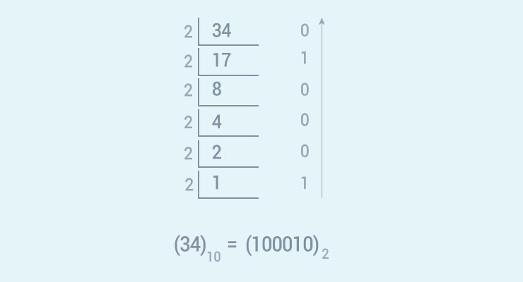

# Python 程序：使用递归将十进制转换为二进制

> 原文： [https://www.programiz.com/python-programming/examples/decimal-binary-recursion](https://www.programiz.com/python-programming/examples/decimal-binary-recursion)

#### 在此程序中，您将学习使用递归函数将十进制数转换为二进制数。

要理解此示例，您应该了解以下 [Python 编程](/python-programming "Python tutorial")主题：

*   [Python `if...else`语句](/python-programming/if-elif-else)
*   [Python 函数](/python-programming/function)
*   [Python 递归](/python-programming/recursion)

* * *

通过将数字连续除以 2 并以相反顺序打印其余部分，将十进制数转换为二进制。



* * *

## 源代码

```py
# Function to print binary number using recursion
def convertToBinary(n):
   if n > 1:
       convertToBinary(n//2)
   print(n % 2,end = '')

# decimal number
dec = 34

convertToBinary(dec)
print() 
```

**输出**

```py
100010 
```

您可以在上述程序中更改变量`dec`，然后运行它以测试其他值。

* * *

该程序仅适用于整数。 它不适用于具有分数值的实数，例如：`25.5`，`45.64`等。 我们鼓励您创建 Python 程序，自行将所有实数的十进制数转换为二进制。