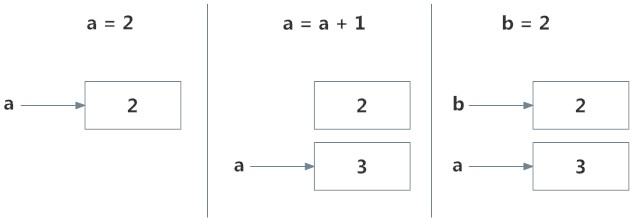

# Python 命名空间和范围

> 原文： [https://www.programiz.com/python-programming/namespace](https://www.programiz.com/python-programming/namespace)

#### 在本教程中，您将了解名称空间，从名称到对象的映射以及变量的范围。

## Python 中的名称是什么？

如果您曾经读过“The Zen of Python”（Python 解释器中的类型`import this`），则最后一行指出，**命名空间是一个很棒的主意-让我们做更多的事情！** 那么这些神秘的命名空间是什么？ 让我们首先看看名字是什么。

名称（也称为标识符）只是赋予对象的名称。 Python 中的所有内容都是[对象](https://www.programiz.com/python-programming/class)。 名称是访问基础对象的一种方式。

例如，当我们执行分配`a = 2`时，`2`是存储在内存中的对象，而`a`是与之关联的名称。 我们可以通过[内置函数](https://www.programiz.com/python-programming/built-in-function) `id()`获得某个对象的地址（在 RAM 中）。 让我们看看如何使用它。

```py
# Note: You may get different values for the id

a = 2
print('id(2) =', id(2))

print('id(a) =', id(a))
```

**输出**

```py
id(2) = 9302208
id(a) = 9302208
```

在这里，两者都引用相同的对象`2`，因此它们具有相同的`id()`。 让我们做些有趣的事情。

```py
# Note: You may get different values for the id

a = 2
print('id(a) =', id(a))

a = a+1
print('id(a) =', id(a))

print('id(3) =', id(3))

b = 2
print('id(b) =', id(b))
print('id(2) =', id(2))
```

**输出**：

```py
id(a) = 9302208
id(a) = 9302240
id(3) = 9302240
id(b) = 9302208
id(2) = 9302208
```

上述步骤序列中发生了什么？ 让我们用一个图来解释一下：



Memory diagram of variables in Python


最初，创建一个对象`2`并将其与名称`b`关联，当我们执行`a = a+1`时，将创建一个新的对象`3`，而现在将`a`与这个对象关联起来。

注意，`id(a)`和`id(3)`具有相同的值。

此外，当执行`b = 2`时，新名称`b`与先前的对象`2`相关联。

这是有效的，因为 Python 不必创建新的重复对象。 名称绑定的这种动态特性使 Python 功能强大。 名称可以引用任何类型的对象。

```py
>>> a = 5
>>> a = 'Hello World!'
>>> a = [1,2,3]
```

所有这些都是有效的，`a`将引用不同实例中的三种不同类型的对象。 [函数](https://www.programiz.com/python-programming/function)也是对象，因此名称也可以引用它们。

```py
def printHello():
    print("Hello")

a = printHello

a()
```

**输出**：

```py
Hello
```

`a`可以使用相同的名称，我们可以使用该名称来调用该功能。

* * *

## Python 中的命名空间是什么？

现在我们了解了名称是什么，我们可以继续进行命名空间的概念。

简而言之，名称空间是名称的集合。

在 Python 中，您可以将名称空间想象为已定义的每个名称到对应对象的映射。

不同的名称空间可以在给定时间共存，但是完全隔离。

当我们启动 Python 解释器时，将创建一个包含所有内置名称的名称空间，并且只要该解释器运行，该名称空间就会存在。

这就是为什么内置`id()`，`print()`等功能始终可以从程序的任何部分使用的原因。 每个[模块](https://www.programiz.com/python-programming/modules)创建其自己的全局名称空间。

这些不同的名称空间是隔离的。 因此，不同模块中可能存在的相同名称不会冲突。

模块可以具有各种功能和类。 调用函数时会创建一个本地名称空间，该名称空间中定义了所有名称。 与类相似。 下图可能有助于阐明这一概念。


A diagram of different namespaces in Python


* * *

## Python 变量范围

尽管定义了各种唯一的名称空间，但我们可能无法从程序的每个部分访问它们。 范围的概念开始起作用。

范围是程序的一部分，从那里可以直接访问名称空间而无需任何前缀。

在任何给定时刻，至少有三个嵌套作用域。

1.  具有局部名称的当前函数的范围
2.  具有全局名称的模块的范围
3.  具有内置名称的最外部作用域

在函数内部进行引用时，将在本地名称空间中搜索名称，然后在全局名称空间中搜索，最后在内置名称空间中搜索。

如果另一个函数内有一个函数，则新作用域嵌套在本地作用域内。

* * *

## Python 范围和命名空间的示例

```py
def outer_function():
    b = 20
    def inner_func():
        c = 30

a = 10
```

在这里，变量`a`在全局命名空间中。 变量`b`在`outer_function()`的本地名称空间中，而`c`在`inner_function()`的嵌套本地名称空间中。

当我们在`inner_function()`中时，`c`对我们来说是本地的，`b`是非本地的，`a`是全局的。 我们可以读取`c`并为其分配新值，但只能从`inner_function()`读取`b`和`a`。

如果我们尝试为`b`赋值，则会在本地名称空间中创建一个与非本地`b`不同的新变量`b`。 当我们为`a`分配一个值时，也会发生同样的事情。

但是，如果我们将`b`为全局变量，则所有引用和赋值都将转到全局变量。 同样，如果我们想重新绑定变量`b`，则必须将其声明为非本地变量。 以下示例将进一步阐明这一点。

```py
def outer_function():
    a = 20

    def inner_function():
        a = 30
        print('a =', a)

    inner_function()
    print('a =', a)

a = 10
outer_function()
print('a =', a)
```

如您所见，该程序的输出为

```py
a = 30
a = 20
a = 10
```

在此程序中，在单独的命名空间中定义了三个不同的变量`a`并进行了相应的访问。 在以下程序中，

```py
def outer_function():
    global a
    a = 20

    def inner_function():
        global a
        a = 30
        print('a =', a)

    inner_function()
    print('a =', a)

a = 10
outer_function()
print('a =', a)
```

程序的输出是。

```py
a = 30
a = 30
a = 30 
```

在这里，由于使用了关键字`global`，所有引用和分配都指向全局`a`。