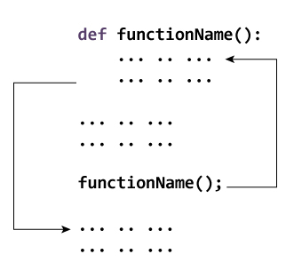

# Python 函数

> 原文： [https://www.programiz.com/python-programming/function](https://www.programiz.com/python-programming/function)

#### 在本文中，您将了解函数，函数是什么，函数的语法，组件和类型。 此外，您还将学习在 Python 中创建函数。

## Python 中的函数是什么？

在 Python 中，函数是一组执行特定任务的相关语句。

函数有助于将我们的程序分解为较小的模块化块。 随着我们的计划变得越来越大，功能使其变得更有组织性和可管理性。

此外，它避免了重复并使代码可重复使用。

### 函数语法

```py
def function_name(parameters):
	"""docstring"""
	statement(s)
```

上面显示的是由以下组件组成的功能定义。

1.  关键字`def`，用于标记函数头的开始。
2.  用于唯一标识功能的功能名称。 函数命名遵循相同的[规则，即在 Python](/python-programming/keywords-identifier#rules) 中编写标识符。
3.  通过其将值传递给函数的参数（参数）。 它们是可选的。
4.  冒号（`:`）标记函数头的结尾。
5.  可选的文档字符串（docstring），用于描述函数的功能。
6.  组成函数体的一个或多个有效 python 语句。 语句必须具有相同的缩进级别（通常为 4 个空格）。
7.  可选的`return`语句，用于从函数返回值。

### 函数示例

```py
def greet(name):
    """
    This function greets to
    the person passed in as
    a parameter
    """
    print("Hello, " + name + ". Good morning!")
```

### 如何在 python 中调用函数？

定义函数后，我们可以从另一个函数，程序甚至 Python 提示符下调用它。 要调用函数，我们只需键入带有适当参数的函数名称即可。

```py
>>> greet('Paul')
Hello, Paul. Good morning!
```

**注意**：尝试在带有函数定义的 Python 程序中运行以上代码，以查看输出。

```py
def greet(name):
    """
    This function greets to
    the person passed in as
    a parameter
    """
    print("Hello, " + name + ". Good morning!")

greet('Paul')
```

* * *

## 文档字符串

函数头之后的第一个字符串称为 docstring，是文档字符串的缩写。 简要说明了函数的作用。

尽管是可选的，但文档是一种好的编程习惯。 除非您记得上周的晚餐时间，否则请务必记录您的代码。

在上面的示例中，我们在函数标头的正下方有一个文档字符串。 我们通常使用三引号，以便文档字符串可以扩展到多行。 该字符串可作为函数的`__doc__`属性使用。

**例如**：

尝试将以下内容运行到 Python shell 中以查看输出。

```py
>>> print(greet.__doc__)

    This function greets to
    the person passed in as
    a parameter
```

要了解有关 Python 中的文档字符串的更多信息，请访问 [Python 文档字符串](/python-programming/docstrings)。

* * *

## `return`语句

`return`语句用于退出函数并返回到调用它的位置。

### `return`语法

```py
return [expression_list]
```

该语句可以包含一个被求值的表达式并返回值。 如果该语句中没有表达式，或者`return`语句本身不存在于函数中，则该函数将返回`None`对象。

**例如**：

```py
>>> print(greet("May"))
Hello, May. Good morning!
None
```

此处，`None`是返回值，因为`greet()`直接打印名称并且不使用`return`语句。

* * *

### `return`示例

```py
def absolute_value(num):
    """This function returns the absolute
    value of the entered number"""

    if num >= 0:
        return num
    else:
        return -num

print(absolute_value(2))

print(absolute_value(-4))
```

**输出**

```py
2
4
```

* * *

## Python 中的函数如何工作？



Working of functions in Python


* * *

## 变量的范围和寿命

变量的范围是程序中可以识别该变量的部分。 从函数外部看不到在函数内部定义的参数和变量。 因此，它们具有本地范围。

变量的生存期是变量在内存中退出的时间。 函数内部变量的生存期与函数执行的时间一样长。

一旦我们从函数返回，它们就会被销毁。 因此，函数无法记住其先前调用中的变量值。

这是一个示例，说明函数内部变量的范围。

```py
def my_func():
	x = 10
	print("Value inside function:",x)

x = 20
my_func()
print("Value outside function:",x)
```

**输出**：

```py
Value inside function: 10
Value outside function: 20
```

在这里，我们可以看到`x`的初始值是 20。 即使功能`my_func()`将`x`的值更改为 10，它也不会影响功能外部的值。

这是因为函数内部的变量`x`与外部的变量不同（局部于函数）。 尽管它们具有相同的名称，但是它们是两个具有不同作用域的不同变量。

另一方面，从外部可以看到函数外部的变量。 它们具有全球范围。

我们可以从函数内部读取这些值，但不能更改（写入）它们。 为了在函数外部修改变量的值，必须使用关键字`global`将它们声明为全局变量。

* * *

## 函数类型

基本上，我们可以将函数分为以下两种类型：

1.  [内置函数](/python-programming/built-in-function)-Python 内置的函数。
2.  [用户定义的功能](/python-programming/user-defined-function)-用户自己定义的功能。