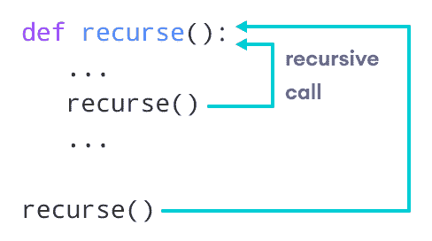
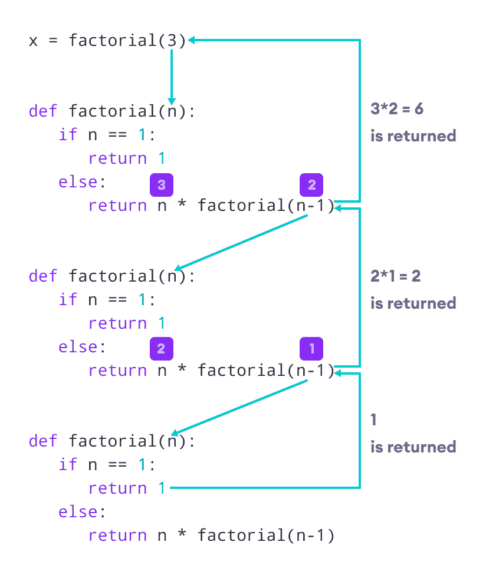

# Python 递归

> 原文： [https://www.programiz.com/python-programming/recursion](https://www.programiz.com/python-programming/recursion)

#### 在本教程中，您将学习创建一个递归函数（一个调用自身的函数）。

## 什么是递归？

递归是根据自身定义某些内容的过程。

一个物理世界的例子是放置两个相互面对的平行反射镜。 它们之间的任何对象都将递归地反映出来。

* * *

## Python 递归函数

在 Python 中，我们知道[函数](/python-programming/function)可以调用其他函数。 函数甚至可能会自行调用。 这些类型的构造称为递归函数。

下图显示了称为`recurse`的递归函数的工作。



Python 中的递归函数


以下是查找整数的阶乘的递归函数的示例。

数字的阶乘是从 1 到该数字的所有整数的乘积。 例如，阶乘 6（表示为`6!`）为`1 * 2 * 3 * 4 * 5 * 6 = 720`。

### 递归函数示例

```py
def factorial(x):
    """This is a recursive function
    to find the factorial of an integer"""

    if x == 1:
        return 1
    else:
        return (x * factorial(x-1))

num = 3
print("The factorial of", num, "is", factorial(num))
```

**输出**

```py
The factorial of 3 is 6
```

在上面的示例中，`factorial()`是一个递归函数，它调用了自己。

当我们使用正整数调用此函数时，它将通过减少数量来递归调用自身。

每个函数将数字乘以其下面的数字的阶乘，直到等于 1。 可以在以下步骤中说明此递归调用。

```py
factorial(3)          # 1st call with 3
3 * factorial(2)      # 2nd call with 2
3 * 2 * factorial(1)  # 3rd call with 1
3 * 2 * 1             # return from 3rd call as number=1
3 * 2                 # return from 2nd call
6                     # return from 1st call
```

让我们看一下显示发生了什么的逐步过程的图像：



递归阶乘函数的原理


当数字减少到 1 时，我们的递归结束。这称为基本条件。

每个递归函数必须具有停止递归的基本条件，否则该函数将无限调用自身。

Python 解释器限制了递归的深度，以帮助避免无限递归，从而导致堆栈溢出。

默认情况下，最大递归深度为 1000。 如果超出限制，则结果为`RecursionError`。 让我们看一个这样的条件。

```py
def recursor():
    recursor()
recursor()
```

**输出**：

```py
Traceback (most recent call last):
  File "<string>", line 3, in <module>
  File "<string>", line 2, in a
  File "<string>", line 2, in a
  File "<string>", line 2, in a
  [Previous line repeated 996 more times]
RecursionError: maximum recursion depth exceeded
```

* * *

## 递归的优点

1.  递归函数使代码看起来干净整洁。
2.  可以使用递归将复杂的任务分解为更简单的子问题。
3.  使用递归比使用嵌套更容易生成序列。

* * *

## 递归的缺点

1.  有时，递归背后的逻辑很难遵循。
2.  递归调用很昂贵（效率低​​），因为它们占用大量内存和时间。
3.  递归函数很难调试。