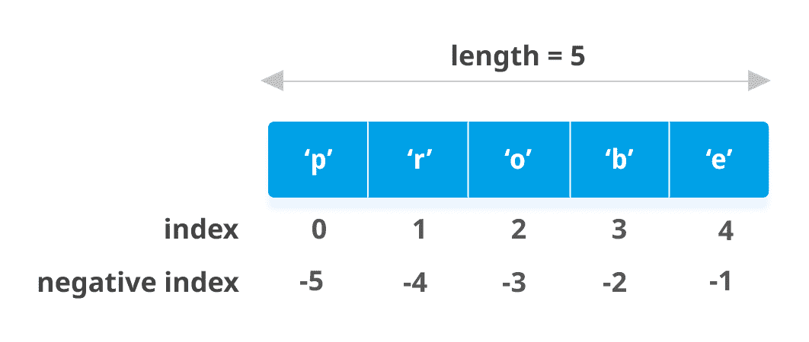

# Python 列表

> 原文： [https://www.programiz.com/python-programming/list](https://www.programiz.com/python-programming/list)

#### 在本文中，我们将学习有关 Python 列表，它们如何创建，列表切片，从中添加或删除元素等所有知识。

Python 提供了一系列通常称为序列的复合数据类型。 `List`是 Python 中使用最频繁且用途最广泛的数据类型之一。

* * *

## 如何建立列表？

在 Python 编程中，通过将所有项目（元素）放在方括号`[]`中并用逗号分隔来创建列表。

它可以具有任意数量的项目，并且它们可以具有不同的类型（整数，浮点数，字符串等）。

```py
# empty list
my_list = []

# list of integers
my_list = [1, 2, 3]

# list with mixed data types
my_list = [1, "Hello", 3.4]
```

一个列表也可以将另一个列表作为项目。 这称为嵌套列表。

```py
# nested list
my_list = ["mouse", [8, 4, 6], ['a']]
```

* * *

## 如何访问列表中的元素？

我们可以通过多种方式访问​​列表的元素。

### 列表索引

我们可以使用索引运算符`[]`访问列表中的项目。 在 Python 中，索引从 0 开始。因此，包含 5 个元素的列表的索引从 0 到 4。

尝试访问除这些以外的索引将引发`IndexError`。 索引必须是整数。 我们不能使用`float`或其他类型，这将导致`TypeError`。

使用嵌套索引访问嵌套列表。

```py
# List indexing

my_list = ['p', 'r', 'o', 'b', 'e']

# Output: p
print(my_list[0])

# Output: o
print(my_list[2])

# Output: e
print(my_list[4])

# Nested List
n_list = ["Happy", [2, 0, 1, 5]]

# Nested indexing
print(n_list[0][1])

print(n_list[1][3])

# Error! Only integer can be used for indexing
print(my_list[4.0])
```

**输出**

```py
p
o
e
a
5
Traceback (most recent call last):
  File "<string>", line 21, in <module>
TypeError: list indices must be integers or slices, not float
```

* * *

### 负索引

Python 允许对其序列进行负索引。 索引 -1 表示最后一项，-2 表示倒数第二项，依此类推。

```py
# Negative indexing in lists
my_list = ['p','r','o','b','e']

print(my_list[-1])

print(my_list[-5])
```

当我们运行上面的程序时，我们将得到以下输出：

```py
e
p
```



List indexing in Python


* * *

## 如何在 Python 中切片列表？

我们可以使用切片运算符`:`（冒号）访问列表中的一系列项目。

```py
# List slicing in Python

my_list = ['p','r','o','g','r','a','m','i','z']

# elements 3rd to 5th
print(my_list[2:5])

# elements beginning to 4th
print(my_list[:-5])

# elements 6th to end
print(my_list[5:])

# elements beginning to end
print(my_list[:])
```

**Output**

```py
['o', 'g', 'r']
['p', 'r', 'o', 'g']
['a', 'm', 'i', 'z']
['p', 'r', 'o', 'g', 'r', 'a', 'm', 'i', 'z']
```

通过考虑索引位于元素之间，可以最好地可视化切片，如下所示。 因此，如果要访问范围，则需要两个索引，这些索引将从列表中切出该部分。


Element Slicing from a list in Python


* * *

## 如何更改或添加元素到列表？

列表是可变的，这意味着可以更改它们的元素，而与[字符串](/python-programming/string)或[元组](/python-programming/tuple)不同。

我们可以使用赋值运算符（`=`）更改一个项目或一系列项目。

```py
# Correcting mistake values in a list
odd = [2, 4, 6, 8]

# change the 1st item    
odd[0] = 1            

print(odd)

# change 2nd to 4th items
odd[1:4] = [3, 5, 7]  

print(odd) 
```

**Output**

```py
[1, 4, 6, 8]
[1, 3, 5, 7]
```

我们可以使用`append()`方法将一个项目添加到列表中，或者使用`extend()`方法将多个项目添加到列表中。

```py
# Appending and Extending lists in Python
odd = [1, 3, 5]

odd.append(7)

print(odd)

odd.extend([9, 11, 13])

print(odd)
```

**Output**

```py
[1, 3, 5, 7]
[1, 3, 5, 7, 9, 11, 13]
```

我们还可以使用`+`运算符组合两个列表。 这也称为串联。

`*`操作符将列表重复给定的次数。

```py
# Concatenating and repeating lists
odd = [1, 3, 5]

print(odd + [9, 7, 5])

print(["re"] * 3)
```

**Output**

```py
[1, 3, 5, 9, 7, 5]
['re', 're', 're']
```

此外，我们可以使用`insert()`方法在所需位置插入一项，也可以通过将其压缩到列表的空切片中来插入多项。

```py
# Demonstration of list insert() method
odd = [1, 9]
odd.insert(1,3)

print(odd)

odd[2:2] = [5, 7]

print(odd)
```

**Output**

```py
[1, 3, 9]
[1, 3, 5, 7, 9]
```

* * *

## 如何从列表中删除或删除元素？

我们可以使用关键字`del`从列表中删除一个或多个项目。 它甚至可以完全删除列表。

```py
# Deleting list items
my_list = ['p', 'r', 'o', 'b', 'l', 'e', 'm']

# delete one item
del my_list[2]

print(my_list)

# delete multiple items
del my_list[1:5]

print(my_list)

# delete entire list
del my_list

# Error: List not defined
print(my_list)
```

**Output**

```py
['p', 'r', 'b', 'l', 'e', 'm']
['p', 'm']
Traceback (most recent call last):
  File "<string>", line 18, in <module>
NameError: name 'my_list' is not defined
```

我们可以使用`remove()`方法删除给定项，或使用`pop()`方法删除给定索引处的项。

如果未提供索引，则`pop()`方法将删除并返回最后一项。 这有助于我们将列表实现为堆栈（先进先出数据结构）。

我们也可以使用`clear()`方法清空列表。

```py
my_list = ['p','r','o','b','l','e','m']
my_list.remove('p')

# Output: ['r', 'o', 'b', 'l', 'e', 'm']
print(my_list)

# Output: 'o'
print(my_list.pop(1))

# Output: ['r', 'b', 'l', 'e', 'm']
print(my_list)

# Output: 'm'
print(my_list.pop())

# Output: ['r', 'b', 'l', 'e']
print(my_list)

my_list.clear()

# Output: []
print(my_list)
```

**Output**

```py
['r', 'o', 'b', 'l', 'e', 'm']
o
['r', 'b', 'l', 'e', 'm']
m
['r', 'b', 'l', 'e']
[]
```

最后，我们还可以通过为元素切片分配一个空列表来删除列表中的项目。

```py
>>> my_list = ['p','r','o','b','l','e','m']
>>> my_list[2:3] = []
>>> my_list
['p', 'r', 'b', 'l', 'e', 'm']
>>> my_list[2:5] = []
>>> my_list
['p', 'r', 'm']
```

* * *

## Python 列表方法

下面列出了 Python 编程中列表对象可用的方法。

可通过`list.method()`对其进行访问。 上面已经使用了某些方法。

[Python 列表方法](/python-programming/methods/list)

+ [**`append()`**](/python-programming/methods/list/append) 在列表的末尾添加元素
+ [**`extend()`**](/python-programming/methods/list/extend) - 将列表的所有元素添加到另一个列表
+ [**`insert()`**](/python-programming/methods/list/insert) - 在定义的索引处插入项目
+ [**`remove()`**](/python-programming/methods/list/remove) - 从列表中删除一个项目
+ [**`pop()`**](/python-programming/methods/list/pop) - 删除并返回给定索引的元素
+ [**`clear()`**](/python-programming/methods/list/clear) - 从列表中删除所有项目
+ [**`index()`**](/python-programming/methods/list/index) - 返回第一个匹配项的索引
+ [**`count()`**](/python-programming/methods/list/count) - 返回作为参数传递的项目数的计数
+ [**`sort()`**](/python-programming/methods/list/sort) - 列表中的项目以升序排序
+ [**`reverse()`**](/python-programming/methods/list/reverse) - 反转列表
+ [**`copy()`**](/python-programming/methods/list/copy) - 返回列表的浅表副本

Python 列表方法的一些示例：

```py
# Python list methods
my_list = [3, 8, 1, 6, 0, 8, 4]

# Output: 1
print(my_list.index(8))

# Output: 2
print(my_list.count(8))

my_list.sort()

# Output: [0, 1, 3, 4, 6, 8, 8]
print(my_list)

my_list.reverse()

# Output: [8, 8, 6, 4, 3, 1, 0]
print(my_list)
```

**Output**

```py
1
2
[0, 1, 3, 4, 6, 8, 8]
[8, 8, 6, 4, 3, 1, 0]
```

* * *

## 列表理解：创建新列表的优雅方式

列表理解是从 Python 现有列表创建新列表的一种简洁明了的方法。

列表推导由方括号内的语句的表达式和[组成。](/python-programming/for-loop)

这是一个列出每项增加 2 的幂的示例。

```py
pow2 = [2 ** x for x in range(10)]
print(pow2)
```

**Output**

```py
[1, 2, 4, 8, 16, 32, 64, 128, 256, 512]
```

此代码等效于：

```py
pow2 = []
for x in range(10):
   pow2.append(2 ** x)
```

如果语句，列表推导可以选择包含更多的`for`或[。 可选的`if`语句可以过滤出新列表的项目。 这里有些例子。](/python-programming/if-elif-else)

```py
>>> pow2 = [2 ** x for x in range(10) if x > 5]
>>> pow2
[64, 128, 256, 512]
>>> odd = [x for x in range(20) if x % 2 == 1]
>>> odd
[1, 3, 5, 7, 9, 11, 13, 15, 17, 19]
>>> [x+y for x in ['Python ','C '] for y in ['Language','Programming']]
['Python Language', 'Python Programming', 'C Language', 'C Programming']
```

* * *

## Python 中的其他列表操作

### 列出会员资格测试

我们可以使用关键字`in`来测试列表中是否存在某项。

```py
my_list = ['p', 'r', 'o', 'b', 'l', 'e', 'm']

# Output: True
print('p' in my_list)

# Output: False
print('a' in my_list)

# Output: True
print('c' not in my_list)
```

**Output**

```py
True
False
True
```

* * *

### 遍历列表

使用`for`循环，我们可以遍历列表中的每个项目。

```py
for fruit in ['apple','banana','mango']:
    print("I like",fruit)
```

**Output**

```py
I like apple
I like banana
I like mango
```