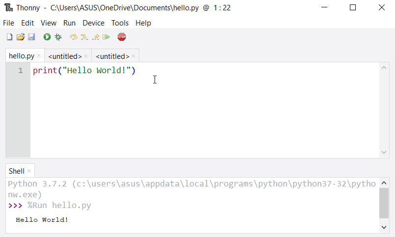
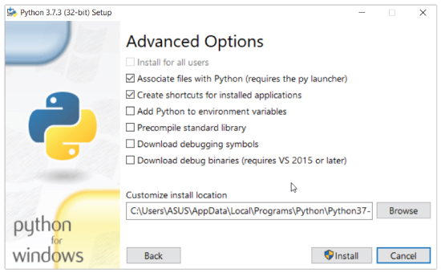
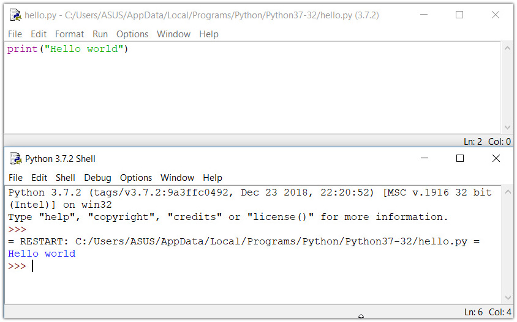

# 如何开始使用 Python？

> 原文： [https://www.programiz.com/python-programming/first-program](https://www.programiz.com/python-programming/first-program)

#### 在本教程中，您将学习在计算机上安装和运行 Python。 一旦做到这一点，我们还将编写我们的第一个 Python 程序。

Python 是一种跨平台的编程语言，这意味着它可以在 Windows，macOS，Linux 等多种平台上运行，甚至可以移植到 Java 和.NET 虚拟机。 它是免费和开源的。

即使当今大多数 Linux 和 Mac 已预装 Python，但该版本可能已过时。 因此，安装最新版本始终是一个好主意。

* * *

## 运行 Python 的最简单方法

运行 Python 的最简单方法是使用 **Thonny IDE**。

Thonny IDE 随附了捆绑的最新版本的 Python。 因此，您不必单独安装 Python。

请按照以下步骤在计算机上运行 Python。

1.  下载 [Thonny IDE](https://thonny.org/) 。
2.  运行安装程序以在计算机上安装 **Thonny** 。
3.  转到“**文件 > 新建**”。 然后以`.py`扩展名保存文件。 例如`hello.py`，`example.py`等。
    您可以为文件指定任何名称。 但是，文件名应以 **.py** 结尾
4.  在文件中编写 Python 代码并保存。

    

    使用 Thonny IDE 运行 Python

    

5.  然后转到**运行** > **运行当前脚本**，或直接单击 **F5** 来运行它。

* * *

## 单独安装 Python

如果您不想使用 Thonny，请按照以下方法在计算机上安装和运行 Python。

1.  下载 Python 的[最新版本](https://www.python.org/downloads/)。
2.  运行安装程序文件，并按照步骤安装 Python
    。在安装过程中，选中**将 Python 添加到环境变量**。 这会将 Python 添加到环境变量中，并且您可以从计算机的任何部分运行 Python。

    另外，您可以选择安装 Python 的路径。

    

    在计算机上安装 Python

    

完成安装过程后，即可运行 Python。

* * *

### 1.在即时模式下运行 Python

安装 Python 后，在命令行中键入`python`将以即时模式调用解释器。 我们可以直接输入 Python 代码，然后按`Enter`键以获取输出。

尝试输入`1 + 1`，然后按`Enter`。 我们得到`2`作为输出。 此提示可以用作计算器。 要退出此模式，请键入`quit()`，然后按`Enter`。


Running Python on the Command Line


* * *

### 2.在集成开发环境（IDE）中运行 Python

我们可以使用任何文本编辑软件来编写 Python 脚本文件。

我们只需要将其保存为`.py`扩展名即可。 但是使用 IDE 可以使我们的生活更加轻松。 IDE 是一款软件，可为程序员提供有用的功能，如代码提示，语法突出显示和检查，文件浏览器等，以供应用程序开发。

顺便说一句，当您安装 Python 时，还将安装一个名为 **IDLE** 的 IDE。 您可以使用它在计算机上运行 Python。 对于初学者来说，这是一个不错的 IDE。

当您打开 IDLE 时，将打开一个交互式 Python Shell。


Python IDLE


现在，您可以创建一个新文件，并以`.py`扩展名保存。 例如，`hello.py`

在文件中编写 Python 代码并保存。 要运行文件，请转到“**运行 > 运行模块**”或直接单击`F5`。



Running a Python program in IDLE


* * *

## 您的第一个 Python 程序

现在我们已经启动并运行了 Python，我们可以编写第一个 Python 程序。

让我们创建一个非常简单的程序`Hello World`。 **“你好，世界！”** 是在屏幕上输出`Hello, World!`的简单程序。 由于它是一个非常简单的程序，因此通常用于向初学者介绍一种新的编程语言。

在任何文本编辑器或 IDE 中键入以下代码，并将其保存为`hello_world.py`

```py
print("Hello, world!")
```

然后，运行文件。 您将获得以下输出。

```py
Hello, world!
```

恭喜你！ 您刚刚用 Python 编写了您的第一个程序。

如您所见，这是一个非常简单的任务。 这就是 Python 编程语言的美。