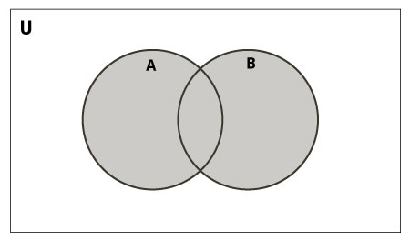
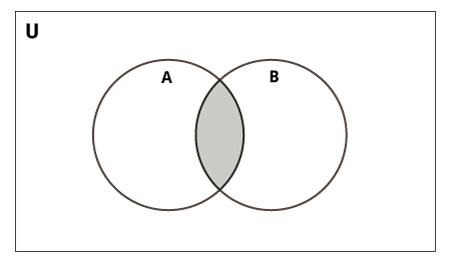
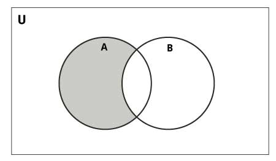
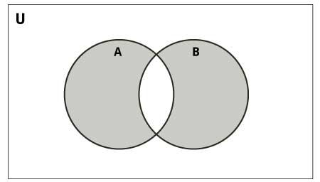

# Python 集

> 原文： [https://www.programiz.com/python-programming/set](https://www.programiz.com/python-programming/set)

#### 在本教程中，您将学习有关 Python 集的所有知识。 如何创建它们，从中添加元素或从中删除元素，以及在 Python 中对集合执行的所有操作。

集合是项目的无序集合。 每个集的元素都是唯一的（没有重复），并且必须是不可变的（无法更改）。

但是，集合本身是可变的。 我们可以从中添加或删除项目。

集还可以用于执行数学集运算，例如并集，交集，对称差等。

* * *

## 创建 Python 集

通过将所有项目（元素）放置在大括号`{}`中（用逗号分隔）或使用内置的`set()`函数，可以创建一个集合。

它可以具有任意数量的项目，并且它们可以具有不同的类型（整数，浮点数，元组，字符串等）。 但是集合不能具有可变元素，例如[列表](/python-programming/list)，集合或[字典](/python-programming/dictionary)作为其元素。

```py
# Different types of sets in Python
# set of integers
my_set = {1, 2, 3}
print(my_set)

# set of mixed datatypes
my_set = {1.0, "Hello", (1, 2, 3)}
print(my_set)
```

**输出**

```py
{1, 2, 3}
{1.0, (1, 2, 3), 'Hello'}
```

也尝试以下示例。

```py
# set cannot have duplicates
# Output: {1, 2, 3, 4}
my_set = {1, 2, 3, 4, 3, 2}
print(my_set)

# we can make set from a list
# Output: {1, 2, 3}
my_set = set([1, 2, 3, 2])
print(my_set)

# set cannot have mutable items
# here [3, 4] is a mutable list
# this will cause an error.

my_set = {1, 2, [3, 4]}
```

**输出**：

```py
{1, 2, 3, 4}
{1, 2, 3}
Traceback (most recent call last):
  File "<string>", line 15, in <module>
    my_set = {1, 2, [3, 4]}
TypeError: unhashable type: 'list'
```

* * *

创建一个空集有点棘手。

空花括号`{}`将在 Python 中创建一个空字典。 为了创建没有任何元素的集合，我们使用不带任何参数的`set()`函数。

```py
# Distinguish set and dictionary while creating empty set

# initialize a with {}
a = {}

# check data type of a
print(type(a))

# initialize a with set()
a = set()

# check data type of a
print(type(a))
```

**输出**：

```py
<class 'dict'>
<class 'set'>
```

* * *

## 在 Python 中修改集合

集是可变的。 但是，由于它们是无序的，因此索引没有意义。

我们无法使用索引或切片来访问或更改集合的元素。 设置数据类型不支持它。

我们可以使用`add()`方法添加一个元素，并使用`update()`方法添加多个元素。`update()`方法可以将[元组](/python-programming/tuple)，列表，[字符串](/python-programming/string)或其他集合用作其参数。 在所有情况下，都避免重复。

```py
# initialize my_set
my_set = {1, 3}
print(my_set)

# if you uncomment line 9,
# you will get an error
# TypeError: 'set' object does not support indexing

# my_set[0]

# add an element
# Output: {1, 2, 3}
my_set.add(2)
print(my_set)

# add multiple elements
# Output: {1, 2, 3, 4}
my_set.update([2, 3, 4])
print(my_set)

# add list and set
# Output: {1, 2, 3, 4, 5, 6, 8}
my_set.update([4, 5], {1, 6, 8})
print(my_set)
```

**输出**：

```py
{1, 3}
{1, 2, 3}
{1, 2, 3, 4}
{1, 2, 3, 4, 5, 6, 8}
```

* * *

## 从集合中删除元素

可以使用`discard()`和`remove()`方法从集合中移除特定项目。

两者之间的唯一区别是，如果元素中不存在`discard()`函数，则该集合将保持不变。 另一方面，在这种情况下，`remove()`函数将引发错误（如果集合中不存在元素）。

以下示例将说明这一点。

```py
# Difference between discard() and remove()

# initialize my_set
my_set = {1, 3, 4, 5, 6}
print(my_set)

# discard an element
# Output: {1, 3, 5, 6}
my_set.discard(4)
print(my_set)

# remove an element
# Output: {1, 3, 5}
my_set.remove(6)
print(my_set)

# discard an element
# not present in my_set
# Output: {1, 3, 5}
my_set.discard(2)
print(my_set)

# remove an element
# not present in my_set
# you will get an error.
# Output: KeyError

my_set.remove(2)
```

**输出**：

```py
{1, 3, 4, 5, 6}
{1, 3, 5, 6}
{1, 3, 5}
{1, 3, 5}
Traceback (most recent call last):
  File "<string>", line 28, in <module>
KeyError: 2
```

同样，我们可以使用`pop()`方法删除并返回一个项目。

由于集是无序数据类型，因此无法确定将弹出哪个项目。 这是完全任意的。

我们还可以使用`clear()`方法从集合中删除所有项目。

```py
# initialize my_set
# Output: set of unique elements
my_set = set("HelloWorld")
print(my_set)

# pop an element
# Output: random element
print(my_set.pop())

# pop another element
my_set.pop()
print(my_set)

# clear my_set
# Output: set()
my_set.clear()
print(my_set)

print(my_set)
```

**输出**：

```py
{'H', 'l', 'r', 'W', 'o', 'd', 'e'}
H
{'r', 'W', 'o', 'd', 'e'}
set()
```

* * *

## Python 设置操作

集合可用于执行数学集合运算，例如并集，交集，差和对称差。 我们可以使用运算符或方法来做到这一点。

让我们考虑以下两组用于以下操作。

```py
>>> A = {1, 2, 3, 4, 5}
>>> B = {4, 5, 6, 7, 8}
```

### 设置联盟



Set Union in Python


`A`和`B`的并集是两个集合中所有元素的集合。

联合使用`|`运算符执行。 使用`union()`方法可以完成相同的操作。

```py
# Set union method
# initialize A and B
A = {1, 2, 3, 4, 5}
B = {4, 5, 6, 7, 8}

# use | operator
# Output: {1, 2, 3, 4, 5, 6, 7, 8}
print(A | B)
```

**输出**：

```py
{1, 2, 3, 4, 5, 6, 7, 8}
```

在 Python shell 上尝试以下示例。

```py
# use union function
>>> A.union(B)
{1, 2, 3, 4, 5, 6, 7, 8}

# use union function on B
>>> B.union(A)
{1, 2, 3, 4, 5, 6, 7, 8}
```

* * *

### 设置相交



Set Intersection in Python


`A`和`B`的交集是在这两组中都相同的一组元素。

交叉使用`&`运算符执行。 使用`intersection()`方法可以完成相同的操作。

```py
# Intersection of sets
# initialize A and B
A = {1, 2, 3, 4, 5}
B = {4, 5, 6, 7, 8}

# use & operator
# Output: {4, 5}
print(A & B)
```

**输出**：

```py
{4, 5}
```

Try the following examples on Python shell.

```py
# use intersection function on A
>>> A.intersection(B)
{4, 5}

# use intersection function on B
>>> B.intersection(A)
{4, 5}
```

* * *

### 设置差异



Set Difference in Python


集合`B`与集合`A`（`A` - `B`）的区别是仅在`A`中的一组元素，但不在`B`中。 类似地，`B` - `A`是`B`中的一组元素，但不是`A`中的一组元素。

使用`-`运算符进行区别。 使用`difference()`方法可以完成相同的操作。

```py
# Difference of two sets
# initialize A and B
A = {1, 2, 3, 4, 5}
B = {4, 5, 6, 7, 8}

# use - operator on A
# Output: {1, 2, 3}
print(A - B)
```

**输出**：

```py
{1, 2, 3}
```

Try the following examples on Python shell.

```py
# use difference function on A
>>> A.difference(B)
{1, 2, 3}

# use - operator on B
>>> B - A
{8, 6, 7}

# use difference function on B
>>> B.difference(A)
{8, 6, 7}
```

* * *

### 设置对称差异



Set Symmetric Difference in Python


`A`和`B`的对称差异是`A`和`B`中的一组元素，但两者都不相同（不包括交叉点）。

对称差使用`^`运算符执行。 使用方法`symmetric_difference()`可以完成相同的操作。

```py
# Symmetric difference of two sets
# initialize A and B
A = {1, 2, 3, 4, 5}
B = {4, 5, 6, 7, 8}

# use ^ operator
# Output: {1, 2, 3, 6, 7, 8}
print(A ^ B)
```

**输出**：

```py
{1, 2, 3, 6, 7, 8}
```

Try the following examples on Python shell.

```py
# use symmetric_difference function on A
>>> A.symmetric_difference(B)
{1, 2, 3, 6, 7, 8}

# use symmetric_difference function on B
>>> B.symmetric_difference(A)
{1, 2, 3, 6, 7, 8}
```

* * *

## 其他 Python 集方法

设置方法有很多，上面已经使用了其中的一些方法。 这是设置对象可用的所有方法的列表：

| 方法 | 描述 |
| --- | --- |
| [`add()`](/python-programming/methods/set/add) | 将元素添加到集合中 |
| [`clear()`](/python-programming/methods/set/clear) | 从集合中删除所有元素 |
| [`copy()`](/python-programming/methods/set/copy) | 返回集合的副本 |
| [`difference()`](/python-programming/methods/set/difference) | 将两个或多个集合的差返回为新集合 |
| [`difference_update()`](/python-programming/methods/set/difference_update) | 从该集合中删除另一个集合的所有元素 |
| [`reject()`](/python-programming/methods/set/discard) | 如果元素是成员，则从集合中删除它。 （如果元素不在集合中，则不执行任何操作） |
| [`intersection()`](/python-programming/methods/set/intersection) | 返回两个集合的交集作为新集合 |
| [`intersection_update()`](/python-programming/methods/set/intersection_update) | 用自身和另一个的交集更新集合 |
| [`isdisjoint()`](/python-programming/methods/set/isdisjoint) | 如果两个集合的交点为空，则返回`True` |
| [`issubset()`](/python-programming/methods/set/issubset) | 如果另一个集合包含此集合，则返回`True` |
| [`issuperset()`](/python-programming/methods/set/issuperset) | 如果此集合包含另一个集合，则返回`True` |
| [`pop()`](/python-programming/methods/set/pop) | 删除并返回一个任意集的元素。 如果集合为空，则升起`KeyError` |
| [`remove()`](/python-programming/methods/set/remove) | 从集合中删除一个元素。 如果元素不是成员，则引发`KeyError` |
| [`symmetric_difference()`](/python-programming/methods/set/symmetric_difference) | 将两个集合的对称差作为新集合返回 |
| [`symmetric_difference_update()`](/python-programming/methods/set/symmetric_difference_update) | 用本身和另一个的对称差异更新一个集合 |
| [`union()`](/python-programming/methods/set/union) | 返回新集合中集合的并集 |
| [`update()`](/python-programming/methods/set/update) | 用自身和他人的并集更新集合 |

* * *

## 其他设置操作

### 设置成员资格测试

我们可以使用`in`关键字来测试项目是否存在于集合中。

```py
# in keyword in a set
# initialize my_set
my_set = set("apple")

# check if 'a' is present
# Output: True
print('a' in my_set)

# check if 'p' is present
# Output: False
print('p' not in my_set)
```

**输出**：

```py
True
False
```

* * *

### 遍历一组

我们可以使用`for`循环遍历集合中的每个项目。

```py
>>> for letter in set("apple"):
...     print(letter)
...    
a
p
e
l
```

* * *

### 集内置函数

诸如`all()`，`any()`，`enumerate()`，`len()`，`max()`，`min()`，`sorted()`，`sum()`等内置功能通常与集合一起使用以执行不同的任务。

| 函数 | Description |
| [`all()`](/python-programming/methods/built-in/all) | 如果集合的所有元素都为`true`（或者集合为空），则返回`True`。 |
| [`any()`](/python-programming/methods/built-in/any) | 如果集合中的任何元素为`true`，则返回`True`。 如果集合为空，则返回`False`。 |
| [`enumerate()`](/python-programming/methods/built-in/enumerate) | 返回一个枚举对象。 它包含该集合中所有项目的索引和值对。 |
| [`len()`](/python-programming/methods/built-in/len) | 返回集合中的长度（项目数）。 |
| [`max()`](/python-programming/methods/built-in/max) | 返回集合中最大的项目。 |
| [`min()`](/python-programming/methods/built-in/min) | 返回集合中最小的项目。 |
| [`sorted()`](/python-programming/methods/built-in/sorted) | 从集合中的元素返回一个新的排序列表（不对集合本身进行排序）。 |
| [`sum()`](/python-programming/methods/built-in/sum) | 返回集合中所有元素的总和。 |

* * *

## Python `Frozenset`

`Frozenset`是具有集合特征的新类，但是一旦分配，就不能更改其元素。 元组是不可变列表，而冻结集是不可变集。

可变的集合不可散列，因此不能用作字典键。 另一方面，`frozenset`是可哈希化的，可用作字典的键。

可以使用[`Frozenset()`](/python-programming/methods/built-in/frozenset)函数创建`Frozenset`。

此数据类型支持`copy()`，`difference()`，`intersection()`，`isdisjoint()`，`issubset()`，`issuperset()`，`symmetric_difference()`和`union()`之类的方法。 由于是不可变的，因此没有添加或删除元素的方法。

```py
# Frozensets
# initialize A and B
A = frozenset([1, 2, 3, 4])
B = frozenset([3, 4, 5, 6])
```

在 Python shell 上尝试这些示例。

```py
>>> A.isdisjoint(B)
False
>>> A.difference(B)
frozenset({1, 2})
>>> A | B
frozenset({1, 2, 3, 4, 5, 6})
>>> A.add(3)
...
AttributeError: 'frozenset' object has no attribute 'add'
```