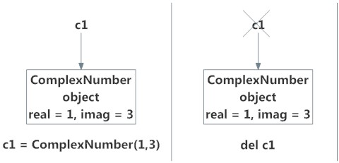

# Python 对象和类

> 原文： [https://www.programiz.com/python-programming/class](https://www.programiz.com/python-programming/class)

#### 在本教程中，您将学习 Python 对象和类的核心功能。 您将学习什么是类，如何创建它并在程序中使用它。

## Python 对象和类

Python 是一种面向对象的编程语言。 与面向过程的程序设计（主要侧重于函数）不同，面向对象的程序设计强调对象。

对象只是数据（变量）和作用于这些数据的方法（函数）的集合。 同样，类是该对象的蓝图。

我们可以将类视为房子的草图（原型）。 它包含有关地板，门，窗户等的所有详细信息。基于这些描述，我们建造了房屋。 房子是对象。

由于可以根据房屋的蓝图建造许多房屋，因此我们可以根据类创建许多对象。 对象也称为类的实例，创建该对象的过程称为**实例化**。

* * *

## 在 Python 中定义一个类

类似的函数定义以 Python 中的[`def`](/python-programming/keyword-list#def)关键字开头，类定义以[`class`](/python-programming/keyword-list#class)关键字开头。

该类中的第一个字符串称为文档字符串，并具有有关该类的简短说明。 尽管不是强制性的，但强烈建议这样做。

这是一个简单的类定义。

```py
class MyNewClass:
    '''This is a docstring. I have created a new class'''
    pass
```

一个类创建一个新的本地[命名空间](/python-programming/namespace)，其中定义了其所有属性。 属性可以是数据或函数。

其中还有一些特殊属性，它们以双下划线`__`开头。 例如，`__doc__`给我们该类的文档字符串。

一旦定义了一个类，就会创建一个具有相同名称的新类对象。 这个类对象使我们可以访问不同的属性以及实例化该类的新对象。

```py
class Person:
    "This is a person class"
    age = 10

    def greet(self):
        print('Hello')

# Output: 10
print(Person.age)

# Output: <function Person.greet>
print(Person.greet)

# Output: 'This is my second class'
print(Person.__doc__)
```

**输出**

```py
10
<function Person.greet at 0x7fc78c6e8160>
This is a person class
```

* * *

## 用 Python 创建对象

我们看到了类对象可以用来访问不同的属性。

它也可以用来创建该类的新对象实例（实例化）。 创建对象的过程类似于[函数](/python-programming/function)的调用。

```py
>>> harry = Person()
```

这将创建一个名为`harry`的新对象实例。 我们可以使用对象名称前缀访问对象的属性。

属性可以是数据或方法。 对象的方法是该类的相应功能。

这意味着，由于`Person.greet`是函数对象（类的属性），因此`Person.greet`将是方法对象。

```py
class Person:
    "This is a person class"
    age = 10

    def greet(self):
        print('Hello')

# create a new object of Person class
harry = Person()

# Output: <function Person.greet>
print(Person.greet)

# Output: <bound method Person.greet of <__main__.Person object>>
print(harry.greet)

# Calling object's greet() method
# Output: Hello
harry.greet()
```

**输出**：

```py
<function Person.greet at 0x7fd288e4e160>
<bound method Person.greet of <__main__.Person object at 0x7fd288e9fa30>>
Hello
```

您可能已经在类内的函数定义中注意到了`self`参数，但是我们将该方法简单地称为`harry.greet()`，而没有任何[参数](/python-programming/function-argument)。 它仍然有效。

这是因为，只要对象调用其方法，该对象本身就会作为第一个参数传递。 因此，`harry.greet()`转换为`Person.greet(harry)`。

通常，调用带有 n 个参数列表的方法等同于调用带有参数列表的函数，该参数列表是通过在第一个参数之前插入方法的对象而创建的。

由于这些原因，类中函数的第一个参数必须是对象本身。 通常将其称为`self`。 可以使用其他名称，但我们强烈建议您遵循约定。

现在，您必须熟悉类对象，实例对象，函数对象，方法对象及其区别。

* * *

## Python 中的构造器

以双下划线`__`开头的类函数由于具有特殊含义而称为特殊函数。

一个特别有趣的是`__init__()`函数。 每当实例化该类的新对象时，都会调用此特殊函数。

这种类型的功能在面向对象编程（OOP）中也称为构造器。 我们通常使用它来初始化所有变量。

```py
class ComplexNumber:
    def __init__(self, r=0, i=0):
        self.real = r
        self.imag = i

    def get_data(self):
        print(f'{self.real}+{self.imag}j')

# Create a new ComplexNumber object
num1 = ComplexNumber(2, 3)

# Call get_data() method
# Output: 2+3j
num1.get_data()

# Create another ComplexNumber object
# and create a new attribute 'attr'
num2 = ComplexNumber(5)
num2.attr = 10

# Output: (5, 0, 10)
print((num2.real, num2.imag, num2.attr))

# but c1 object doesn't have attribute 'attr'
# AttributeError: 'ComplexNumber' object has no attribute 'attr'
print(num1.attr)
```

**输出**：

```py
2+3j
(5, 0, 10)
Traceback (most recent call last):
  File "<string>", line 27, in <module>
    print(num1.attr)
AttributeError: 'ComplexNumber' object has no attribute 'attr'
```

在上面的示例中，我们定义了一个新类来表示复数。 它具有两个功能，`__init__()`初始化变量（默认为零），`get_data()`正确显示数字。

在上面的步骤中要注意的一件有趣的事情是，可以动态创建对象的属性。 我们为对象`num2`创建了一个新属性`attr`，并且也读取了该属性。 但这不会为对象`num1`创建该属性。

* * *

## 删除属性和对象

可以使用`del`语句随时删除对象的任何属性。 在 Python Shell 上尝试以下操作以查看输出。

```py
>>> num1 = ComplexNumber(2,3)
>>> del num1.imag
>>> num1.get_data()
Traceback (most recent call last):
...
AttributeError: 'ComplexNumber' object has no attribute 'imag'

>>> del ComplexNumber.get_data
>>> num1.get_data()
Traceback (most recent call last):
...
AttributeError: 'ComplexNumber' object has no attribute 'get_data'
```

我们甚至可以使用`del`语句删除对象本身。

```py
>>> c1 = ComplexNumber(1,3)
>>> del c1
>>> c1
Traceback (most recent call last):
...
NameError: name 'c1' is not defined
```

实际上，它比这更复杂。 当我们执行`c1 = ComplexNumber(1,3)`时，会在内存中创建一个新的实例对象，并且名称`c1`与之绑定。

在命令`del c1`上，将删除此绑定，并从相应的名称空间中删除名称`c1`。 但是，该对象继续存在于内存中，如果没有其他名称绑定，则该对象随后会自动销毁。

在 Python 中这种对未引用对象的自动销毁也称为垃圾回收。



在 Python 中删除对象会删除名称绑定

