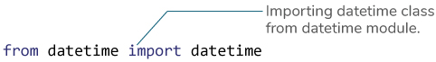
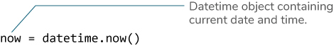
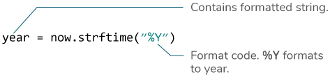
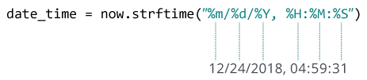

# Python `strftime()`

> 原文： [https://www.programiz.com/python-programming/datetime/strftime](https://www.programiz.com/python-programming/datetime/strftime)

#### 在本文中，您将学习如何将日期，时间和日期时间对象转换为其等效的字符串（借助示例）

`strftime()`方法使用[日期](/python-programming/datetime#date)，[时间](/python-programming/datetime#time)或 [datetime](/python-programming/datetime#datetime) 对象返回表示日期和时间的字符串。

* * *

## 示例 1：使用`strftime()`将日期时间转换为字符串

下面的程序将包含当前日期和时间的`datetime`对象转换为不同的字符串格式。

```py
 from datetime import datetime

now = datetime.now() # current date and time

year = now.strftime("%Y")
print("year:", year)

month = now.strftime("%m")
print("month:", month)

day = now.strftime("%d")
print("day:", day)

time = now.strftime("%H:%M:%S")
print("time:", time)

date_time = now.strftime("%m/%d/%Y, %H:%M:%S")
print("date and time:",date_time) 
```

运行程序时，输出将如下所示：

```py
 year: 2018
month: 12
day: 24
time: 04:59:31
date and time: 12/24/2018, 04:59:31 
```

这里，`year`，`day`，`time`和`date_time`是字符串，而`now`是`datetime`对象。

* * *

## `strftime()`如何工作？

在上述程序中，`%Y`，`%m`，`%d`等是格式代码。`strftime()`方法采用一个或多个格式代码作为参数，并基于该代码返回格式化的字符串。

1.  我们从`datetime`模块导入了`datetime`类。 这是因为`datetime`类的对象可以访问`strftime()`方法。

    

2.  包含当前日期和时间的`datetime`对象存储在`now`变量中。

    

3.  `strftime()`方法可用于创建格式化的字符串。

    

4.  您传递给`strftime()`方法的字符串可能包含多个格式代码。

    

* * *

## 示例 2：根据时间戳创建字符串

```py
 from datetime import datetime

timestamp = 1528797322
date_time = datetime.fromtimestamp(timestamp)

print("Date time object:", date_time)

d = date_time.strftime("%m/%d/%Y, %H:%M:%S")
print("Output 2:", d)	

d = date_time.strftime("%d %b, %Y")
print("Output 3:", d)

d = date_time.strftime("%d %B, %Y")
print("Output 4:", d)

d = date_time.strftime("%I%p")
print("Output 5:", d) 
```

运行该程序时，输出为：

```py
Date time object: 2018-06-12 09:55:22
Output 2: 06/12/2018, 09:55:22
Output 3: 12 Jun, 2018
Output 4: 12 June, 2018
Output 5: 09AM 
```

* * *

## 格式代码列表

下表显示了您可以传递给`strftime()`方法的所有代码。

| **指令** | **含义** | **示例** |
| --- | --- | --- |
| `%a` | 工作日名称的缩写。 | 周日，周一... |
| `%A` | 工作日全名。 | 星期天星期一， ... |
| `%w` | 工作日为十进制数字。 | 0, 1, ..., 6 |
| `%d` | 月份中的一天，以零填充的十进制数表示。 | 01, 02, ..., 31 |
| `%-d` | 以十进制数字表示的月份中的一天。 | 1, 2, ..., 30 |
| `%b` | 缩写的月份名称。 | 一月，二月，...，十二月 |
| `%B` | 完整的月份名称。 | 一月二月， ... |
| `%m` | 以零填充的十进制数字表示的月份。 | 01, 02, ..., 12 |
| `%-m` | 以十进制数表示的月份。 | 1, 2, ..., 12 |
| `%y` | 无世纪的年份，为零填充的十进制数字。 | 00, 01, ..., 99 |
| `%-y` | 没有世纪的年份作为十进制数字。 | 0, 1, ..., 99 |
| `%Y` | 以世纪作为十进制数字的年份。 | 2013、2019 等 |
| `%H` | 小时（24 小时制），为补零的十进制数字。 | 00, 01, ..., 23 |
| `%-H` | 小时（24 小时制）为十进制数字。 | 0, 1, ..., 23 |
| `%I` | 小时（12 小时制），为零填充的十进制数字。 | 01, 02, ..., 12 |
| `%-I` | 小时（12 小时制）为十进制数字。 | 1, 2, ... 12 |
| `%p` | 语言环境的上午或下午。 | 上午下午 |
| `%M` | 分钟，为零填充的十进制数字。 | 00, 01, ..., 59 |
| `%-M` | 以十进制数字表示。 | 0, 1, ..., 59 |
| `%S` | 第二个为零填充的十进制数。 | 00, 01, ..., 59 |
| `%-S` | 第二个十进制数字。 | 0, 1, ..., 59 |
| `%f` | 微秒，十进制数，在左侧补零。 | 000000 - 999999 |
| `%z` | UTC 偏移量，格式为`+HHMM`或`-HHMM`。 |   |
| `%Z` | 时区名称。 |   |
| `%j` | 一年中的一天，以零填充的十进制数字表示。 | 001, 002, ..., 366 |
| `%-j` | 一年中的天，以十进制数字表示。 | 1, 2, ..., 366 |
| `%U` | 一年中的第几周（星期日为一周的第一天）。 新年中第一个星期日之前的所有天均视为第 0 周。 | 00, 01, ..., 53 |
| `%W` | 一年中的第几周（星期一为一周的第一天）。 第一个星期一之前的新的一年中的所有天都视为在第 0 周。 | 00, 01, ..., 53 |
| `%c` | 语言环境的适当日期和时间表示。 | 2013 年 9 月 30 日星期一 07:06:05 |
| `%x` | 语言环境的适当日期表示形式。 | 09/30/13 |
| `%X` | 语言环境的适当时间表示形式。 | 07:06:05 |
| `%%` | 文字`%`字符。 | % |

* * *

## 示例 3：语言环境的适当日期和时间

```py
 from datetime import datetime

timestamp = 1528797322
date_time = datetime.fromtimestamp(timestamp)

d = date_time.strftime("%c")
print("Output 1:", d)	

d = date_time.strftime("%x")
print("Output 2:", d)

d = date_time.strftime("%X")
print("Output 3:", d) 
```

当你运行程序时，输出将是：

```py
 Output 1: Tue Jun 12 09:55:22 2018
Output 2: 06/12/18
Output 3: 09:55:22 
```

格式代码`%c`，`%x`和`%X`用于语言环境的适当日期和时间表示。

* * *

我们还建议您检查 [Python `strptime()`](/python-programming/datetime/strptime "strptime()")。`strptime()`方法从字符串创建`datetime`对象。