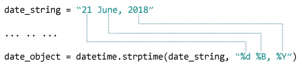

# Python `strptime()`

> 原文： [https://www.programiz.com/python-programming/datetime/strptime](https://www.programiz.com/python-programming/datetime/strptime)

#### 在本文中，您将学习从字符串创建`datetime`对象（借助示例）。

`strptime()`方法根据给定的字符串创建[日期时间](/python-programming/datetime#datetime)对象。

**注意**：不能从每个字符串创建`datetime`对象。 该字符串必须采用某种格式。

* * *

## 示例 1：日期时间对象的字符串

```py
 from datetime import datetime

date_string = "21 June, 2018"

print("date_string =", date_string)
print("type of date_string =", type(date_string))

date_object = datetime.strptime(date_string, "%d %B, %Y")

print("date_object =", date_object)
print("type of date_object =", type(date_object)) 
```

运行该程序时，输出为：

```py
 date_string = 21 June, 2018
type of date_string = <class 'str'>
date_object = 2018-06-21 00:00:00
type of date_object = <class 'datetime.datetime'> 
```

* * *

### `strptime()`如何工作？

`strptime()`类方法采用两个参数：

*   字符串（将转换为日期时间）
*   格式码

根据使用的字符串和格式代码，该方法返回其等效的`datetime`对象。

在上面的示例中：



这里，

*   `%d` - 代表每月的某天。 **示例**： 01，02，...，31
*   `%B` - 月份的全名。 **示例**：一月，二月等
*   `%Y` - 四位数的年份。 **示例**： 2018，2019 等

* * *

## 示例 2：日期时间对象的字符串

```py
 from datetime import datetime

dt_string = "12/11/2018 09:15:32"

# Considering date is in dd/mm/yyyy format
dt_object1 = datetime.strptime(dt_string, "%d/%m/%Y %H:%M:%S")
print("dt_object1 =", dt_object1)

# Considering date is in mm/dd/yyyy format
dt_object2 = datetime.strptime(dt_string, "%m/%d/%Y %H:%M:%S")
print("dt_object2 =", dt_object2) 
```

当你运行程序时，输出将是：

```py
dt_object1 = 2018-11-12 09:15:32
dt_object2 = 2018-12-11 09:15:32 
```

* * *

## 格式代码列表

下表显示了您可以使用的所有格式代码。

| **指令** | **含义** | **示例** |
| --- | --- | --- |
| `%a` | 缩写的工作日名称。 | `Sun, Mon, ...` |
| `%A` | 完整的工作日名称。 | `Sunday, Monday, ...` |
| `%w` | 工作日，表示为十进制数字。 | `0, 1, ..., 6` |
| `%d` | 月份中的一天，表示为以零填充的十进制数。 | `01, 02, ..., 31` |
| `%-d` | 月份中的一天，表示为无填充的十进制数字。 | `1, 2, ..., 30` |
| `%b` | 缩写的月份名称。 | `Jan, Feb, ..., Dec` |
| `%B` | 完整的月份名称。 | `January, February, ...` |
| `%m` | 月份，表示为以零填充的十进制数字。 | `01, 02, ..., 12` |
| `%-m` | 月份，表示为无填充的十进制数。 | `1, 2, ..., 12` |
| `%y` | 没有世纪的年份，表示为以零填充的十进制数字。 | `00, 01, ..., 99` |
| `%-y` | 没有世纪的年份，表示为无填充的十进制数字。 | `0, 1, ..., 99` |
| `%Y` | 带世纪的年份，表示为十进制数字。 | `2013, 2019, ...` |
| `%H` | 小时（24 小时制），表示为以零填充的十进制数字。 | `00, 01, ..., 23` |
| `%-H` | 小时（24 小时制），表示为无填充的十进制数字。 | `0, 1, ..., 23` |
| `%I` | 小时（12 小时制），表示为以零填充的十进制数字。 | `01, 02, ..., 12` |
| `%-I` | 小时（12 小时制），表示为无填充的十进制数字。 | `1, 2, ... 12` |
| `%p` | 语言环境的上午或下午。 | `AM, PM` |
| `%M` | 分钟，表示为以零填充的十进制数字。 | `00, 01, ..., 59` |
| `%-M` | 分钟，表示为无填充的十进制数字。 | `0, 1, ..., 59` |
| `%S` | 秒钟，表示为以零填充的十进制数字。 | `00, 01, ..., 59` |
| `%-S` | 秒钟，表示为无填充的十进制数字。 | `0, 1, ..., 59` |
| `%f` | 微秒，表示为以零填充的十进制数。 | `000000 - 999999` |
| `%z` | UTC 偏移量，格式为`+HHMM`或`-HHMM`。 | ` ` |
| `%Z` | 时区名称。 | ` ` |
| `%j` | 一年中的一天，表示为以零填充的十进制数字。 | `001, 002, ..., 366` |
| `%-j` | 一年中的一天，表示为无填充的十进制数字。 | `1, 2, ..., 366` |
| `%U` | 一年中的星期（星期日为一周的第一天）。 新年中第一个星期日之前的所有天都视为第 0 周。 | `00, 01, ..., 53` |
| `%W` | 一年中的星期（星期一为一周的第一天）。 新年中第一个星期一之前的所有天都视为第 0 周。 | `00, 01, ..., 53` |
| `%c` | 适合语言环境的日期和时间表示。 | `Mon Sep 30 07:06:05 2013` |
| `%x` | 适合语言环境的日期表示形式。 | `09/30/13` |
| `%X` | 适合语言环境的时间表示形式。 | `07:06:05` |
| `%%` | 字面值`%`字符。 | `%` |

* * *

### `strptime()`中的`ValueError`

如果传递给`strptime()`的字符串（第一个参数）和格式代码（第二个参数）不匹配，则会得到`ValueError`。 例如：

```py
 from datetime import datetime

date_string = "12/11/2018"
date_object = datetime.strptime(date_string, "%d %m %Y")

print("date_object =", date_object) 
```

如果运行此程序，则会出现错误。

```py
ValueError: time data '12/11/2018' does not match format '%d %m %Y' 
```

* * *

**推荐阅读**： [Python `strftime()`](/python-programming/datetime/strftime)