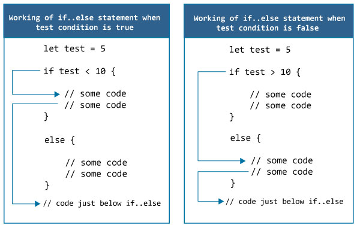

# Swift `if`，`if...else`语句

> 原文： [https://www.programiz.com/swift-programming/if-else-statement](https://www.programiz.com/swift-programming/if-else-statement)

#### 在本文中，您将学习使用两个条件语句：`if`和`if...else`来控制程序执行的流程。

在编程中，您可能希望根据指定的条件`true`或`false`（仅在运行时知道）执行不同的操作。 在这种情况下，将使用控制流语句。

* * *

## Swift `if`语句

Swift 中`if`语句的语法为：

```swift
if expression {
	// statements
}
```

*   这里`expression`是一个布尔表达式（返回`true`或`false`）。
*   如果将`expression`求值为`true`，则将执行`if`代码块内部的语句。
*   如果将`expression`求值为`false`，则将跳过`if`代码块内部的语句。

* * *

### `if`语句如何工作？


* * *

### 示例 1：Swift `if`语句

```swift
let number = 10
if number > 0 {
	print("Number is positive.")
}
print("This statement is always executed.") 
```

运行该程序时，输出为：

```swift
Number is positive.
This statement is always executed.
```

在上面的程序中，我们用值 10 初始化了常量`number`，并且测试表达式`number > 0`的计算结果为`true`。 因此，执行`if`语句体内的`print("Number is positive.")`语句，输出`Number is positive.`。

现在，将`number`的值更改为负整数。 假设`-5`。 在这种情况下的输出将是：

```swift
This statement is always executed.
```

当`number`初始化为值 -5 时，测试表达式`number > 0`的计算结果为`false`。 因此，Swift 编译器会跳过`if`语句主体的执行。

* * *

## Swift `if..else`语句

如果测试表达式的值为`true`，则`if`语句执行代码的特定部分。 `if`语句可以具有可选的`else`语句。 如果测试表达式为假，则将执行`else`语句主体内的代码。

`if-else`语句的语法为：

```swift
if expression {
	// statements
} else {
	// statements
}
```

* * *

### `if..else`语句如何工作？



* * *

### 示例 2：Swift `if else`语句

```swift
let number = 10
if number > 0 {
	print("Number is positive.")
} else {
	print("Number is not positive.")
}
print("This statement is always executed.") 
```

运行该程序时，输出为：

```swift
Number is positive.
This statement is always executed
```

在上述程序中，常数`number`初始化为值 10，并且测试表达式`number > 0`的值为`true`。 因此，`if`语句体内的语句`print("Number is positive.")`被执行。

输出`Number is positive.`，`else`主体内部的语句将被跳过。

现在，将`number`的值更改为负数。 假设 -5。 在这种情况下的输出将是：

```swift
Number is not positive.
This statement is always executed.
```

当`number`为 -5 时，将测试表达式`number > 0`求值为`false`。 在这种情况下，将执行`else`主体内部的语句，并跳过`if`主体内部的语句。

您还可以在 Swift 中用[三元运算符](/swift-programming/ternary-conditional-operator "Swift ternary conditional operator")替换`if..else`语句，这是`if...else`语句的简写形式。

* * *

## Swift `if..else..if`语句

在 Swift 中，还可以在许多代码中执行一个代码块。 为此，可以将`if..else..if`阶梯用作：

`if-else-if`语句的语法为：

```swift
if expression1 {
	// statements
}
else if expression2 {
	// statements
}
else if expression3 {
	// statements
}
.
.
else {
	// statements
}
```

`if`语句从上到下执行。 一旦测试表达式为真，将在该`if`语句的主体内部执行代码。 然后，程序控制跳到`if-else-if`梯形图之外。

如果所有测试表达式均为`false`，则执行`else`主体内部的代码

* * *

### 示例 3：Swift `if..else..if`语句

以下程序检查`number`是正数，负数还是 0。

```swift
let number = 0;
if number > 0 {
	print("Number is positive.")
}
else if (number < 0) {
	print("Number is negative.")
}
else {
	print("Number is 0.")
} 
```

运行该程序时，输出为：

```swift
Number is 0.
```

在上面的程序中，常量`number`初始化为值 0。由于从上到下执行语句，因此它将检查计算为`false`的表达式`number > 0`。

然后，它检查下一个表达式`number < 0`，该表达式的结果也为`false`。

因此，执行`else`主体内部的语句`print("Number is 0.")`，其输出`Number is 0.`。

* * *

## Swift 嵌套`if..else`语句

在 Swift 中，`if..else`语句中可能包含`if..else`语句。 称为嵌套`if...else`语句。

您还可以在 Swift 中用[`switch`](/swift-programming/switch-statement "Swift switch statement")替换嵌套的`if..else`语句，这在处理几个可能的选项时有时是一种更简单的方法。

嵌套的`if-else`语句的语法为：

```swift
if expression1 {
	if expression2 {
		// statements
	} else {
		// statements
	}
}
else {
	if expression3 {
		// statements
	} else {
		// statements
	}
}
```

* * *

### 示例 4：嵌套`if...else`语句

这是一个使用嵌套的`if`语句查找 3 个数字中最大的一个的程序。

```swift
let n1 = -1.0, n2 = 4.5, n3 = -5.3
if n1 >= n2 {
	if n1 >= n3 {
		print("Largest number is ", n1)
	}
	else {
		print("Largest number is ", n3)
	}
}
else {
	if n2 >= n3 {
		print("Largest number is ",  n2)
	}
	else {
		print("Largest number is ",  n3)
	}
} 
```

当您运行上述程序时，输出将是：

```swift
Largest number is 4.5
```