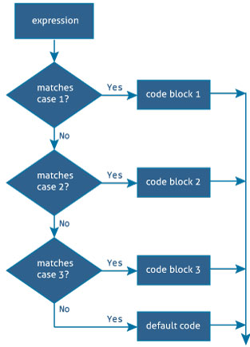

# 迅捷开关声明

> 原文： [https://www.programiz.com/swift-programming/switch-statement](https://www.programiz.com/swift-programming/switch-statement)

#### 在本文中，您将学习使用开关控制语句来控制程序执行的流程。

switch 语句也是各种 Swift 控制语句，例如 [if-else](/swift-programming/if-else-statement "Swift if-else statement") ，[保护](/swift-programming/guard-statement)等，根据不同的条件执行不同的动作。

switch 语句的优点在于，它可以将值与几种可能的匹配模式进行比较。 因此，它可以在匹配复杂模式时用作长`if..else..if`梯形图的替代品。

* * *

## switch 语句的语法

switch 语句的语法为：

```swift
switch variable/expression {
case value1:
	// statements
case value2:
	// statements
default:
	// statements
}
```

* * *

## Swift 中的 Switch 语句如何工作？

*   开关表达式只计算一次。
*   它采用表达式并按顺序（上->下）与每个个案值进行比较。
*   如果存在匹配项，则将执行 case 内的语句，并在第一个匹配的 switch case 完成后立即完成整个 switch 语句的执行。
*   如果没有匹配的情况，则落到下一个情况。
*   如果没有大小写匹配，则 default 关键字指定要运行的代码。



**注意**：每种情况的正文都必须至少包含一个可执行语句。

* * *

### 示例 1：使用 Switch 语句的简单程序

```swift
let dayOfWeek = 4

switch dayOfWeek {
	case 1:
		print("Sunday")

	case 2:
		print("Monday")

	case 3:
		print("Tuesday")

	case 4:
		print("Wednesday")

	case 5:
		print("Thursday")

	case 6:
		print("Friday")

	case 7:
		print("Saturday")

	default:
		print("Invalid day")
} 
```

当您运行上述程序时，输出将是：

```swift
Wednesday
```

在上述程序中，switch 语句通过将`dayOfWeek`值与**情况 1** 匹配来开始。 由于`dayOfWeek`值与第一个案例值 1 不匹配，因此它会降到下一个案例，直到一个匹配。

由于**案例 4** 与 switch 表达式匹配，因此执行该案例中的语句`print("Wednesday")`并终止 switch case。 如果没有大小写匹配，则执行**默认**内部的语句。

* * *

### 示例 2：带有穿透的 Switch 语句

如果在 case 语句中使用`fallthrough`关键字，则即使 case 值与 switch 表达式不匹配，控制也会继续进行下一个 case。

```swift
let dayOfWeek = 4
switch dayOfWeek {
	case 1 :
		print("Sunday")

	case 2:
		print("Monday")

	case 3:
		print("Tuesday")

	case 4:
		print("Wednesday")
		fallthrough

	case 5:
		print("Thursday")

	case 6:
		print("Friday")

	case 7:
		print("Saturday")

	default:
		print("Invalid day")
} 
```

When you run the above program, the output will be:

```swift
Wednesday
Thursday
```

在上述程序中，**情况 4** 执行语句`print("Wednesday")`，`fallthrough`关键字进入 **case5** 。 即使大小写与 switch 表达式不匹配， **case 5** 中的语句`print("Thursday")`也会执行。 因此，您可以在控制台中看到星期四的输出**。**

* * *

### 示例 3：具有更复杂模式的 Switch 语句

```swift
let programmingLanguage = (name: "Go", version: 10)
switch programmingLanguage {

	case (let name,let version) where (version < 0 && name.count < 0) :
		print("Invalid input")

	case ("Swift",let version) where version == 4:
		print("Found latest version of Swift")

	case ("Swift" , ..<4 ):
		print("Found older version of swift)")

	case ("Swift" ,4...) :
		print("Swift version greater than 4 is not released yet")

	case ("Taylor Swift",30) :
		print("OMG. This is Taylor swift")

	case (let name, let version):  
		print("""
			Programming Language:\(name)
			Version: \(version)
			Status: Not found
		""")
} 
```

When you run the above program, the output will be:

```swift
Programming Language:Go
Version: 10
Status: Not found
```

在上面的程序中，我们以不同的情况匹配元组类型的表达式`programmingLanguage`，如下所示：

*   `case (let name,let version) where (version < 0 && name.count < 0)`

    这种情况下，将开关表达式值绑定到临时常量或变量，以使用`let`关键字在案例的正文中使用。 这称为值绑定。

    您也可以使用`where`子句将条件应用于这些值。 对于多个条件，您可以使用`&&`运算符将它们连接起来，如上例所示。

    如果条件不满足 where 子句中定义的条件，则这些 case 块内的语句将不执行，并且无法通过比较下一个 switch 的条件。

*   `case ("Swift" , ..<4 )`

    这种情况将元组第一个元素与字符串文字`"Swift"`匹配，并且还检查第二个元素是否在单边范围`..<4`内。

*   `case ("Swift" ,4...)`

    这种情况将元组第一个元素与字符串文字`"Swift"`匹配，并且还检查第二个元素是否在单边范围`4…`内。

*   `case (let name, let version)`

    这种情况将元组的每个值绑定到临时常量或变量。