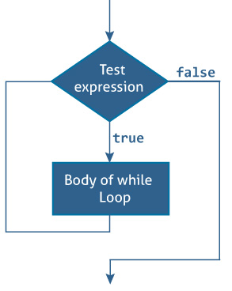
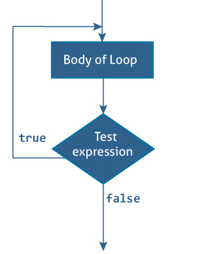

# 快速的`while`并重复`while`循环

> 原文： [https://www.programiz.com/swift-programming/repeat-while-loop](https://www.programiz.com/swift-programming/repeat-while-loop)

#### 在本文中，您将学习在 Swift 编程中创建`while`并`repeat..while`循环。

在上一篇文章中，我们了解了[`for-in`循环](/swift-programming/for-in-loop "Swift for-in loop")，用于在一定次数下运行一组任务。 在本文中，您将学习在未知迭代次数时使用`while`和`repeat..while`作为`for-in`循环的替代方法。

`while`循环执行一组语句，直到条件变为`false`为止。 当第一次迭代开始之前未知迭代次数时，最好使用此类循环。 Swift 提供了两种`while`循环：

* * *

## 1\. Swift `While`循环

该循环在每次通过循环的开始时求值其条件。

`while`循环的语法为：

```swift
while (TestExpression) {
    // statements
}
```

* * *

### `while`循环如何工作？

`TestExpression`是布尔表达式。

如果将`TestExpression`求值为`true`，

*   `while`循环内的语句被执行。
*   并再次求值`TestExpression`。

该过程一直进行到`TestExpression`求值为`false`为止。 如果`TestExpression`求值为`false`，则`while`循环终止。

* * *

### `While`循环流程图



* * *

### 示例 1：`While`循环

```swift
var currentLevel:Int = 0, finalLevel:Int = 5
let gameCompleted = true
while (currentLevel <= finalLevel) {
    //play game
    if gameCompleted {
        print("You have passed level \(currentLevel)")
        currentLevel += 1
    }
}
print("outside of while loop")
```

运行该程序时，输出为：

```swift
You have passed level 0
You have passed level 1
You have passed level 2
You have passed level 3
You have passed level 4
You have passed level 5
outside of while loop 
```

在上述程序中，变量`currentLevel`和`finalLevel`初始化为 0，常量`gameCompleted`初始化为`true`。

在`while`循环的每次迭代中，它都会检查条件`currentLevel <= finalLevel`。 如果条件返回`true`，则执行`while`循环内的语句，否则循环终止。

Execution steps

| 迭代 | 条件（`currentLevel <= finalLevel`） | 输出 |
| --- | --- | --- |
| 1 |` 0 <= 5`（真） | `You have passed level 0` |
| 2 | `1 <= 5`（真） | `You have passed level 1` |
| 3 | `2 <= 5`（真） | `You have passed level 2` |
| 4 | `3 <= 5`（真） | `You have passed level 3` |
| 5 | `4 <= 5`（真） | `You have passed level 4` |
| 6 | `5 <= 5`（真） | `You have passed level 5` |
| 7 | `6 <= 5`（假） | `outside of while loop ` |

* * *

## 2.`repeat...while`循环

该循环在每次循环结束时求值其条件。`repeat...while`循环类似于`while`循环，但有一个关键区别。 在检查测试表达式之前，执行一次`repeat ... while`循环主体。

`repeat..while`循环的语法为：

```swift
repeat {
    // statements
    ...
} while (testExpression)
```

* * *

### `repeat...while`循环如何工作？

`repeat...while`循环的主体执行一次（在检查测试表达式之前）。 只有这样，才检查`testExpression`。

如果将`testExpression`求值为`true`，则执行循环体内的语句，然后再次求值`testExpression`。 该过程一直进行到`testExpression`求值为`false`为止。

当`testExpression`为`false`时，`repeat..while`循环终止。

* * *

### `repeat...while`循环的流程图



* * *

### 示例 2：`repeat...while`循环

```swift
var currentLevel:Int = 0, finalLevel:Int = 5
let gameCompleted = true
repeat {
    //play game
    if gameCompleted {
        print("You have passed level \(currentLevel)")
        currentLevel += 1
    }
} while (currentLevel <= finalLevel)
print("outside of repeat while loop") 
```

运行该程序时，输出为：

```swift
You have passed level 0
You have passed level 1
You have passed level 2
You have passed level 3
You have passed level 4
You have passed level 5
outside of repeat while loop 
```

在上面的示例中，循环内的语句首次执行。 对于下一次迭代，它将检查条件`currentLevel <= finalLevel`。

如果条件返回`true`，则执行`while`循环内的语句，否则循环终止。

Execution steps

| 迭代 | 条件（`currentLevel <= finalLevel`） | 输出 |
| --- | --- | --- |
| 1 | `0 <= 5`（`true`） | `You have passed level 0` |
| 2 | `1 <= 5`（`true`） | `You have passed level 1` |
| 3 | `2 <= 5`（`true`） | `You have passed level 2` |
| 4 | `3 <= 5`（`true`） | `You have passed level 3` |
| 5 | `4 <= 5`（`true`） | `You have passed level 4` |
| 6 | `5 <= 5`（`true`） | `You have passed level 5` |
| 7 | `6 <= 5`（`false`） | `outside of repeat while loop ` |

尽管`while`和`repeat while`循环具有相同的执行步骤，但是`repeat while`循环上的条件`currentLevel <= finalLevel`仅在执行其中的语句之后才执行。

但是在`while`中，条件是在开始时检查的，然后在其中执行语句。

* * *

## 3.无限循环

如果测试表达式的取值从未为`false`，则`while`和`repeat..while`循环的主体将执行无数次。

### 示例 3：无限`while`循环

```swift
while (true) {
   print("Hello, World!")
}
```

```swift
repeat {
   print("Hello, World!")

} while (true)
```

运行该程序时，输出为：

```swift
Hello, World!
Hello, World!
.
.
.
```

当您运行程序时，两个循环都将无限次执行`print("Hello, World!")`语句。 因此，您可以看到连续输出<string>您好，世界！ 控制台中的</string>。