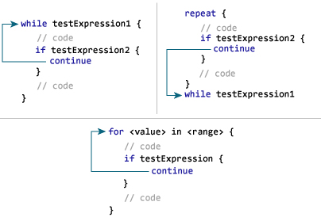
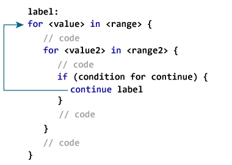

# 迅速继续声明

> 原文： [https://www.programiz.com/swift-programming/continue-statement](https://www.programiz.com/swift-programming/continue-statement)

#### 在本文中，您将学习使用 continue 语句来转移程序的控制权。

使用循环或条件语句时，可能需要跳过循环内的某些语句或立即终止循环，而不检查测试表达式。

在这种情况下，将使用 break 和 Continue 语句。 访问页面以了解有关 [break 语句](/swift-programming/break-statement "Swift break statement")的更多信息。

Continue 语句停止在循环或 switch 语句内执行语句。 然后，它会跳回以再次评估循环的测试表达式。

Continue 语句的语法为：

```swift
continue
```

* * *

## 继续语句如何工作？



* * *

## 示例 1：for 循环中的 Swift 继续语句

```swift
for i in 1...5 {
    if i == 4 {
        continue
    }
    print("i = \(i)")
} 
```

运行该程序时，输出为：

```swift
i = 1
i = 2
i = 3
i = 5 
```

在上面的程序中，要迭代的序列的范围是 1 到 5。

`i` 的值设置为范围（1）中的第一个数字，并在每次迭代时更新为范围的下一个数字。

该循环还包含带有表达式`i == 4`的 if 语句。 当表达式为真时（第 4 次迭代），该表达式将执行`continue`语句，跳过语句`print("i = \(i)")`的执行并移至下一个迭代（i = 5）。

* * *

## 示例 2：while 循环中的 Swift Continue 语句

```swift
var intialLevel:Int = -5, finalLevel:Int = 2
var currentLevel:Int = intialLevel

while currentLevel < finalLevel {
    if intialLevel < 0 {
        print("Starting level must be positive")
        intialLevel = 0
        currentLevel = intialLevel
        continue //skips the current execution
    }
    currentLevel += 1
    print("next level")
}
print("outside of while loop") 
```

运行该程序时，输出为：

```swift
Starting level must be positive
next level
next level
outside of while loop 
```

在上面的程序中，while 循环运行直到 `currentLevel` 小于 `finalLevel` 为止。 由于 `intialLevel` 被分配值为-5 并且小于 0，因此将执行`if`内部的语句。

当程序到达`continue`语句时，它将跳过 while 循环的语句，并再次跳转以检查条件`currentLevel < finalLevel`。

* * *

## 示例 3：带嵌套循环的 Swift 继续语句

```swift
for j in 1...2 {
    for i in 1...5 {
        if i == 4 {
            continue
        }
        print("i = \(i)")
    }
    print("j = \(j)")
} 
```

When you run the program,the output will be:

```swift
i = 1
i = 2
i = 3
i = 5
j = 1
i = 1
i = 2
i = 3
i = 5 
```

在上面的程序中，`if i == 4`内的`continue`语句仅跳过内部 for 循环内的`print("i = \(i)")`语句的执行。 但是，它不会跳过外循环`for i in 1...5`的执行。

但是，如果您也想`continue`外循环该怎么办。 为此，您需要在 Swift 中使用带标签的语句。

* * *

## 带继续标记的语句

前缀为（label：Statement）形式的语句称为带标签的语句。 标签是一个标识符，您可以稍后在 break 或 continue 语句中引用它。 要了解有关标记语句的更多信息，请访问 *Swift 标记语句*。

### 带 continue 的标记语句如何工作？



在此，`label`是标识符。 当执行`continue`语句时，程序将跳过循环中其余的代码，并跳转到`label`开始的语句。

### 示例 4：带有继续的标签语句

```swift
outerloop: for j in 1...2 {
    innerloop: for i in 1...5 {
        if i == 4 {
            continue outerloop
        }
        print("i = \(i)")
    }
    print("j = \(j)")
} 
```

When you run the program, the output will be:

```swift
i = 1
i = 2
i = 3
i = 1
i = 2
i = 3 
```

在上面的程序中，有两个标记的语句`outerloop: for j in 1...2`和`innerloop: for i in 1...5`。

标签名称 `externalloop` 和 `innerloop` 可以与`continue`语句一起使用。

在程序中，我们使用语句`continue outerloop`跳过内部循环和外部循环中的语句执行。 在此过程中， `i` 和 `j` 的值都更新为该范围内的下一个数字。