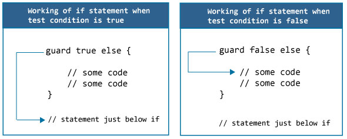

# 迅速的警卫声明

> 原文： [https://www.programiz.com/swift-programming/guard-statement](https://www.programiz.com/swift-programming/guard-statement)

#### 在本文中，您将学习使用 Guard 语句来控制程序执行的流程。

[Swift If 语句](/swift-programming/if-else-statement "Swift if-else statement")描述了如何根据特定条件（布尔值）执行操作。 在本文中，我们将探讨 Guard 语句相对于 if 语句的好处，以控制程序流程并编写更简单，更干净的代码。

## 快速卫队声明

Guard 语句的主要用途是在某些条件下将程序控制权移出范围。 这些语句与 if 语句类似，后者根据特定条件（布尔值）执行语句，但与 if 不同，guard 语句仅在不满足特定条件时运行。

而且，保护内部的语句必须退出范围。 因此，我们必须在保护语句的末尾使用用户程序控制语句`return`，`break`，`continue`或`throw`。

* * *

## 保护声明的语法

```swift
guard expression else {
	//statements
	//must contain a control statement:return, break, continue or throw.
}

```

*   在这里，`expression`是布尔表达式（返回`true`或`false`）。
*   如果将`expression`求值为`false`，则将执行`guard`代码块内部的语句。
*   如果将`expression`求值为`true`，则将跳过`guard`代码块内部的语句。

* * *

## 保护声明如何工作？



注意：保护语句的末尾必须包含控制语句`return`，`break`，`continue`或`throw`。

* * *

## 示例 1：保护声明如何工作？

一个简单的有效警卫声明如下：

```swift
guard true else {
	print("Condition not met")
}
print("Condition met") 
```

运行该程序时，输出为：

```swift
Condition met
```

在上面的程序中，guard 包含一个布尔值 true（满足条件）。 由于 guard 语句仅在不满足条件时运行，因此不会执行 guard 内的语句。 这就是执行`print("Condition met")`并在屏幕上输出**条件满足**的原因。

现在，将条件更改为 false：

* * *

## 示例 2：guard 语句必须退出范围

```swift
guard false else {
	print("Condition not met")
}
print("Condition met") 
```

在以上程序中，保护条件求值为`false`。 因此，else 内部的`print("Condition not met")`语句应执行。 但是您会收到一个错误消息，说**的“守卫”机体可能不会掉落，请考虑使用“返回”或“投掷”退出示波器。**

简单的错误消息表示，您需要使用`return`，`break`，`continue`或`throw`语句从保护语句转移程序控制。 现在，我们将使用`return`。 并且由于`return`语句只能在函数内部使用，因此我们将上述代码包装在 *Swift Functions* 中。

* * *

## 示例 3：函数内部的保护语句

我们可以在 Swift 的[函数中使用 guard 语句：](/swift-programming/functions "Swift functions")

```swift
func someFunction() {

	guard false else {
		print("Condition not met")
		return
	}
	print("Condition met")
}

someFunction()
print("Hello after function call") 
```

当您运行上述程序时，输出将是：

```swift
Condition not met
Hello after function call 
```

在上述程序中，保护条件的计算结果为`false`，因此执行保护内部的语句。 第一个语句`print("Condition not met")`输出**在控制台中不满足**的条件。

并且语句`return`终止函数的执行，并且执行函数调用后的语句`print("Hello, after function call")`在控制台中在函数调用之后输出 **Hello。**

* * *

## 示例 4：带有可选组件的防护

我们已经在 [Swift Optionals](/swift-programming/optionals "Swift Optionals") 中看到了`if-let`的使用，以展开可选项。 但是，我们也可以使用保护声明代替`if-let`来展开具有一个优点的可选项。 展开带保护的可选项而不是`if-let`的主要优点是，我们可以扩大展开的变量的范围。

让我们在下面的示例中看到这一点：

```swift
func changeOptionalStringToUpperCase() {

	var name:String?
	guard let temp = name else {
		print("Name is nil. Cannot process")
		return
	}
	print("Uppercased:\(temp.uppercased())")
}

changeOptionalStringToUpperCase() 
```

When you run the above program, the output will be:

```swift
Name is nil. Cannot process
```

在上述程序中，您可以看到在保护声明定义的范围之外使用了未包装的值`temp`。 由于`name`被定义为可选并且包含 nil 值，因此 guard 语句无法解包该值。

因此，将执行后卫内部的语句，该语句打印**名称为 nil。 无法在输出中处理**，并使用`return`语句终止函数。 上述保护语句 if-else 语句的等效代码是：

```swift
func changeOptionalStringToUpperCase() {

	var name:String?
	if let temp = name {
		print("Uppercased:\(temp.uppercased())")
	} else {
		print("Name is nil. Cannot process")
		return
    }
	//how to access temp here?? Solution:Use Guard
}

changeOptionalStringToUpperCase() 
```

注意上面的两个语句都是有效的并且执行相同的工作。 但是，使用 if-let 语句不能在 if-let 语句之外使用未包装的值。 但是，通过使用警卫声明，您可以在整个函数中使用未包装的值。

* * *

## 范例 5：有多种条件的守卫

Guard 语句还可以链接多个条件，这些条件之间用逗号（，）分隔，如下所示：

```swift
func changeOptionalStringToUpperCase() {
	var name:String? = ""
	guard let temp = name , temp.count > 0  else {
		print("Name is nil or an empty string. Cannot process")
		return
	}
	print("Uppercased:\(temp.uppercased())")
}

changeOptionalStringToUpperCase()
```

When you run the above program, the output will be:

```swift
Name is nil or an empty string. Cannot process
```

在上面的程序中，guard 语句包含两个条件，以逗号分隔。

在我们的例子中，第一个条件`let temp = name`解开了一个可选参数，该可选参数返回`true`，第二个条件`temp.count > 0`检查了已解包的字符串是否包含超过 0 个字符，在我们的示例中，结果为`false`。

因此，guard 语句内部的语句执行语句`print("Name is nil or an empty string. Cannot process")`，该语句输出**名称为 nil 或空字符串。 无法在控制台中处理**并使用`return`语句终止功能。