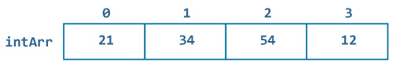
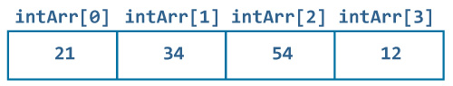

# Swift 数组

> 原文： [https://www.programiz.com/swift-programming/arrays](https://www.programiz.com/swift-programming/arrays)

#### 在本教程中，您将学习数组，创建数组，访问数组的值以及数组中的一些常见操作。

在先前的 [Swift 数据类型](/swift-programming/data-types "Swift Data types")文章中，我们了解了如何创建可以容纳单个值的某些数据类型的变量/常量。

但是，如果我们要存储相同数据类型的多个值怎么办。 我们在 Swift 中使用了**数组**。

* * *

## 什么是数组？

数组只是一个容器，可以在一个有序列表中保存一个数据类型的多个数据（值），即，您以与定义数组中各项相同的顺序获得元素。

数组可以存储任何数据类型的值，例如`Int`，`String`，类等

* * *

## 如何在 Swift 中声明数组？

您可以通过在方括号`[]`中指定数据类型来创建一个空数组。

请记住，您必须在方括号内包括类型，否则 Swift 会将其视为普通数据类型，并且您只能在其中存储一个值。

### 示例 1：声明一个空数组

```swift
let emptyIntArr:[Int] = []
print(emptyIntArr) 
```

运行该程序时，输出为：

```swift
[ ]
```

在上面的程序中，我们声明了一个常量`emptyIntArr`，该常量可以存储整数数组并用 0 值初始化。

**或**

您还可以如下定义一个空数组：

```swift
let emptyIntArr:Array<Int> = Array()
print(emptyIntArr) 
```

**或**

由于 swift 是一种类型推断语言，因此您也可以直接创建数组而无需指定数据类型，但是必须使用一些值进行初始化，以便编译器可以将其类型推断为：

### 示例 2：声明具有某些值的数组

```swift
let someIntArr = [1, 2, 3, 4, 5, 6, 7, 8, 9]
print(someIntArr) 
```

运行该程序时，输出为：

```swift
[1, 2, 3, 4, 5, 6, 7, 8, 9]
```

在上面的程序中，我们声明了一个常量`someIntArr`，该常量可以存储`Integer`数组，而无需显式指定类型。 另外，我们用值`[1,2,3,4,5,6,7,8,9]`初始化了数组。

* * *

### 示例 3：声明包含指定数量的单个重复值的数组

您还可以重复给定值多次以在 Swift 中形成数组。 这是通过将数组初始化器与`repeating`和`count`一起使用来完成的。

```swift
let arrWithRepeatingValues = Array(repeating: "Hello, World", count: 4)
print(arrWithRepeatingValues) 
```

运行该程序时，输出为：

```swift
["Hello, World", "Hello, World", "Hello, World", "Hello, World"]
```

在上面的程序中，我们定义了一个常量`arrWithRepeatingValues`，该常量存储字符串`"Hello, World"`的**数组** ，并将相同的值重复 4 次，如`count`中指定的那样 ]。

**注意**：在 Swift 中，不能像在其他编程语言中一样创建固定长度大小的数组。 固定长度大小的数组意味着，数组中的元素不能超过初始化期间定义的元素。

* * *

## 值如何存储在数组中？

假设您有一个可以存储字符串数组的常量，如下所示：

```swift
let intArr = [21, 34, 54, 12]
```

值如何存储在数组中的图形表示如下所示：



您创建的所有数组都从索引 0 开始。第一个元素存储在索引 0 中，第二个元素存储在下一个索引（1）中，依此类推。

* * *

## 如何在 Swift 中访问数组元素？

您可以使用*下标语法*来访问数组的元素，即，您需要在数组名称后的方括号内包含要访问的值的索引。

假设您如上所述声明了一个数组`intArr`。 第一个元素是`intArr [0]`，第二个元素是`intArr [1]`，依此类推。



### 示例 4：访问数组的元素

```swift
let intArr = [21, 34, 54, 12]
print(intArr[0])
print(intArr[1])
print(intArr[2])
print(intArr[3]) 
```

运行该程序时，输出为：

```swift
21
34
54
12 
```

您也可以使用`for-in`循环访问数组的元素。 有关更多信息，请参见 [Swift `For-in`循环](/swift-programming/for-in-loop#collection "Swift for-in loop")。

* * *

## 如何在 Swift 中修改/添加数组元素？

您可以使用*下标语法*和赋值运算符来修改数组的元素，即，需要在数组名称之后的方括号内包括要更新的值的索引，然后是赋值运算符和新值。

### 示例 5：修改数组的元素

```swift
var intArr = [21, 34, 54, 12]
intArr[0] = 12
intArr[1] = 42
intArr[2] = 45
intArr[3] = 21
print(intArr) 
```

运行该程序时，输出为：

```swift
[12, 42, 45, 21]
```

您还可以使用新值修改数组的所有元素，如下所示：

* * *

### 示例 6：整体修改数组

```swift
var intArr = [21, 34, 54, 12]
intArr = [1,2,3]
print(intArr) 
```

运行该程序时，输出为：

```swift
[1, 2, 3]
```

但是，要将新元素添加到现有数组中，则不能使用下标语法。 如果这样做，最终将导致错误。 您不能执行以下操作：

* * *

### 示例 7：使用下标语法在数组中添加新元素（无效）

```swift
var intArr = [21, 34, 54, 12]
intArr[4] = 10 
```

运行该程序时，输出为：

```swift
fatal error: Index out of range
```

在将新元素分配给数组`intArr`时，上述程序给出了错误。 这是因为`intArr`尚未为索引 4 分配额外的内存，并且无法存储给定值。

为了正确地将新元素插入数组，我们使用数组的`append()`方法。`append()`在以下部分中描述。

* * *

## 一些有用的内置数组函数&属性

### 1\. `isEmpty`

此属性确定数组是否为空。 如果数组不包含任何值，则返回`true`，否则返回`false`。

#### 示例 8：`isEmpty`如何工作？

```swift
let intArr = [21, 34, 54, 12]
print(intArr.isEmpty) 
```

运行该程序时，输出为：

```swift
false
```

* * *

### 2.`first`

此属性用于访问数组的第一个元素。

#### 示例 9：`first`如何工作？

```swift
let intArr = [21, 34, 54, 12]
print(intArr.first) 
```

运行该程序时，输出为：

```swift
Optional(21)
```

同样，您可以使用`last`属性访问数组的最后一个元素。

* * *

### 3.`append`

`append`函数用于在数组末尾插入/附加元素。

#### 示例 10：`append`如何工作？

```swift
var intArr = [21, 34, 54, 12]
intArr.append(32)
print(intArr) 
```

运行该程序时，输出为：

```swift
[21, 34, 54, 12, 32]
```

您还可以将一个数组的内容附加到另一个数组，如下所示：

```swift
var firstArr = [1,2,3,4]
var secondArr = [5,6,7,8]
firstArr.append(contentsOf: secondArr)
print(firstArr) 
```

运行该程序时，输出为：

```swift
[1, 2, 3, 4, 5, 6, 7, 8]
```

* * *

### 4.`insert`

此函数用于在数组的特定索引处插入/附加元素。

#### 示例 11：`insert`如何工作？

```swift
var intArr = [21,34,54,12]
intArr.insert(22, at: 1)
print(intArr) 
```

运行该程序时，输出为：

```swift
[21, 22, 34, 54, 12]
```

同样，您也可以使用`remove`属性删除指定索引处的元素。

* * *

### 5.`remove`

此函数从数组中删除并返回在指定位置指定的值。

#### 示例 12：`remove`如何工作？

```swift
var strArr = ["ab","bc","cd","de"]
let removedVal = strArr.remove(at: 1)
print("removed value is \(removedVal)")
print(strArr) 
```

运行该程序时，输出为：

```swift
removed value is bc
["ab", "cd", "de"] 
```

同样，您还可以使用`removeFirst`删除数组的第一个元素，`removeLast`删除数组的最后一个元素和`removeAll`清空数组的功能。

* * *

### 6.`reversed`

此函数以相反的顺序返回数组的元素。

#### 示例 13：`reversed()`如何工作？

```swift
var intArr = [21,22,23,24]
let reversedArr = Array(intArr.reversed())
print(reversedArr) 
```

运行该程序时，输出为：

```swift
[24, 23, 22, 21]
```

* * *

### 7.`count`

此属性返回数组中元素的总数。

#### 示例 14：`count`

```swift
let floatArr = [10.2,21.3,32.0,41.3]
print(floatArr.count) 
```

运行该程序时，输出为：

```swift
4
```

* * *

## 要记住的事情

在 Swift 中使用下标语法访问数组元素时，必须确保该值位于索引中，否则将导致运行时崩溃。 让我们在示例中看一下：

```swift
let intArr = [21, 34, 54, 12]
print(intArr[-1]) 
```

运行该程序时，输出为：

```swift
fatal error: Index out of range
```

在上述程序中，索引 **-1** 中没有值。 因此，当您尝试访问索引中的值时，将发生运行时崩溃。

为防止这种情况，请首先找到您要删除的元素的索引。 然后删除索引处的元素，如下所示：

```swift
var intArr = [21, 34, 54, 12]
if let index = intArr.index(of: 34) {
    print("found index")
    let val =  intArr.remove(at: index)
    print(val)
} 
```

运行该程序时，输出为：

```swift
found index
34 
```