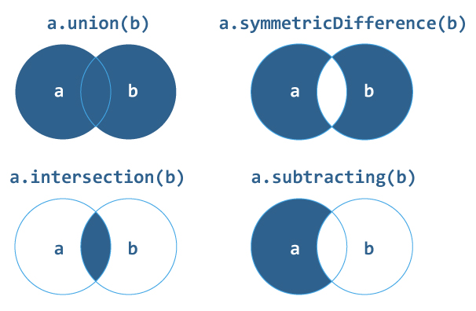

# 迅捷套装

> 原文： [https://www.programiz.com/swift-programming/sets](https://www.programiz.com/swift-programming/sets)

#### 在本教程中，您将了解集合，创建集合，修改集合以及集合中的一些常见操作。

在先前的 [Swift Arrays](/swift-programming/arrays) 文章中，我们了解了如何创建可以在有序列表中包含多个值的数组。

但是，如果必须确保列表只能容纳一次值，则可以在 Swift 中使用一个集合。

* * *

## 什么是集合？

集只是一个容器，可以在无序列表中保存多个数据类型的值，并确保容器中的元素唯一（即每个数据仅出现一次）。

无序列表意味着您将不会以与`Set`中定义的项目相同的顺序获得元素。

在数组上使用`Set`的主要优点是，当您需要确保一个项目仅出现一次并且项目的顺序不重要时。

集合中存储的值必须是**可散列的**。 这意味着它必须提供`hashValue`属性。 这很重要，因为集合是无序的，并且它使用`hashValue`用于访问集合的元素。

Swift 的所有基本类型（例如`String`，`Int`，`Double`和`Bool`）在默认情况下都是可哈希的，并且可以用作设置值类型。 但是，您还可以在 Swift 中创建可存储在集合中的哈希类型。

* * *

## 如何在 Swift 中声明集合？

您可以通过将类型指定为`Set`，然后再将其存储在`< >`中的数据类型来创建一个空集。

### 示例 1：声明一个空集

```swift
let emptyIntSet:Set <int>= []
print(emptyIntSet)</int> 
```

**或**

```swift
let emptyIntSet:Set <int>= Set<int>()
print(emptyIntSet)</int></int> 
```

运行该程序时，输出为：

```swift
[ ]
```

在上面的程序中，我们声明了一个类型为`Set`的常量`emptyIntSet`，它可以存储多个整数值并用 0 值初始化。

由于 Swift 是一种类型推断语言，因此您也可以在不指定数据类型的情况下直接创建集，但是必须使用一些值进行初始化，以便编译器可以将其类型推断为：

### 示例 2：声明具有某些值的集合

```swift
let someIntSet:Set = [1, 2, 3, 4, 5, 6, 7, 8, 9]
print(someIntSet) 
```

When you run the program, the output will be:

```swift
[2, 4, 9, 5, 6, 7, 3, 1, 8]
```

在上面的程序中，我们声明了一个常量`someIntSet`，该常量可以存储`Integer`集，而无需显式指定类型。 但是，定义变量时我们需要写`:Set`，否则 Swift 会为我们创建一个数组。

另外，作为数组，我们使用`[]`括号将 **1、2、3、4、5、6、7、8、9** 值初始化为集合。

如您所知，当您尝试将集合内的值打印为`print(someIntSet)`时，您将以与定义集合中的项不同的顺序获得结果，因为它存储的值没有定义的顺序。 因此，每次访问订单时都会更改。

### 示例 3：声明具有重复值的集合

```swift
let someStrSet:Set = ["ab","bc","cd","de","ab"]
print(someStrSet) 
```

When you run the program, the output will be:

```swift
["de", "ab", "cd", "bc"]
```

在上面的程序中，我们在集合中定义了重复值`ab`。 和。 当我们尝试使用`print(someStrSet)`访问集合内的值时，重复值将自动从集合中删除。 因此，集保证了其中的唯一元素/值。

您还可以在 Swift 中使用自己的自定义`Hashable`类型声明一个集合。 要了解更多信息，请访问 Swift `Hashable`。

* * *

## 如何在 Swift 中访问集合元素？

您无法使用*下标语法*作为数组访问集合的元素。 这是因为集合是无序的，并且没有索引来访问元素。

因此，您需要使用其方法和属性或使用`for-in`循环来访问集合。

#### 示例 4：访问集合中的元素

```swift
var someStrSet:Set = ["ab", "bc", "cd", "de"]
for val in someStrSet {
    print(val)
} 
```

When you run the program, the output will be:

```swift
de
ab
cd
bc 
```

在上面的程序中，我们以与集合元素不同的顺序获得`val`，因为集合与数组不同，它们是无序的。

您还可以访问集合的元素，如下所示直接从集合中删除值：

* * *

#### 示例 5：使用`remove()`访问集合中的元素

```swift
var someStrSet:Set = ["ab", "bc", "cd", "de"]
let someVal = someStrSet.remove("cd")
print(someVal)
print(someStrSet) 
```

When you run the program, the output will be:

```swift
Optional("cd")
["de", "ab", "bc"] 
```

在上面的程序中，您可以看到`remove`方法返回一个可选字符串。 因此，建议您执行以下可选处理。 要了解有关可选件的更多信息，请访问 [Swift 可选项](/swift-programming/optionals "Swift Optionals")。

* * *

#### 示例 6：`remove()`的可选处理

```swift
var someStrSet:Set = ["ab", "bc", "cd", "de"]
if let someVal = someStrSet.remove("cd") {
    print(someVal)
    print(someStrSet)
} else {
    print("cannot find element to remove")
} 
```

When you run the program, the output will be:

```swift
cd
["de", "ab", "bc"] 
```

* * *

## 如何在集合中添加新元素？

您可以使用 Swift 中的`insert()`方法将新元素添加到集合中。

### 示例 7：使用`insert()`添加新元素

```swift
var someStrSet:Set = ["ab", "bc", "cd", "de"]
someStrSet.insert("ef")
print(someStrSet) 
```

When you run the program, the output will be:

```swift
["ab", "de", "cd", "ef", "bc"]
```

在上面的程序中，我们使用集合的`insert()`方法向集合添加新元素。 由于集合是无序的，因此未知插入元素的位置。

* * *

## 设置操作

使用集合的另一个主要优点是您可以执行集合操作，例如将两个集合组合在一起，确定两个集合具有哪些共同的值等。此操作类似于数学中的集合操作。



### 1.并集

两个集合`a`和`b`的并集是`a`或`b`或`a`和`b`两者中的元素的集合。

```swift
let a: Set = [1, 3, 5, 7, 9]
let b: Set = [0, 2, 4, 6, 8]
print(a.union(b)) 
```

当您运行上述程序时，输出将是：

```swift
[8, 2, 9, 4, 5, 7, 6, 3, 1, 0]
```

* * *

### 2.交集

两个集合`a`和`b`的交集是包含`a`的所有元素的集合，这些元素也属于`b`。

```swift
let a: Set = [1, 3, 5, 7, 9]
let b: Set = [0, 3, 7, 6, 8]
print(a.intersection(b)) 
```

运行该程序时，输出为：

```swift
[7, 3]
```

因此，`print(a.intersection(b))`将输出一个新的集合，其值在 a 和 b 中都是相同的 **[7，3]** 。

* * *

### 3.减去

两个集合 a 和 b 的减法是包含 a 的所有元素的集合，但删除了也属于 b 的元素。

```swift
let a: Set = [1, 3, 5, 7, 9]
let b: Set = [0, 3, 7, 6, 8]
print(a.subtracting(b)) 
```

运行该程序时，输出为：

```swift
[5, 9, 1]
```

因此，`print(a.subtracting(b))`输出具有值 **[5、9、1]** 的新集合。

* * *

### 4.对称差异

两个集合 a 和 b 的对称差是包含所有元素的集合，这些元素位于两个集合中的任何一个中，但不在两个集合中。

```swift
let a: Set = [1, 3, 5, 7, 9]
let b: Set = [0, 3, 7, 6, 8]
print(a.symmetricDifference(b)) 
```

运行该程序时，输出为：

```swift
[5, 6, 8, 0, 1, 9]
```

因此，`print(a.symmetricDifference(b))`输出具有值 **[5、6、8、0、1、9]** 的新集合。

* * *

## 设置成员资格和平等运营

### 设置相等

您可以使用`==`运算符检查两组是否包含相同的元素。 如果两个集合包含相同的元素，则返回 true，否则返回 false。

#### 示例 5：设置相等操作

```swift
let a: Set = [1, 3, 5, 7, 9]
let b: Set = [0, 3, 7, 6, 8]
let c:Set = [9, 7, 3, 1, 5]

if a == b {
    print("a and b are same")
} else {
    print("a and b are different")
}

if a == c {
    print("a and c are same")
} else {
    print("a and c are different")
} 
```

运行该程序时，输出为：

```swift
a and b are different
a and c are same
```

* * *

### 设置成员资格

您还可以使用以下方法检查两个集合之间的关系：

*   `isSubset(of:)`此方法确定指定集合中是否包含集合的所有值。
*   `isSuperset(of:)`此方法确定一个集合是否包含指定集合中的所有值
*   `isStrictSubset(of:`或`isStrictSuperset(of:)`：此方法确定集合是子集还是超集，但不等于指定的集。
*   `isDisjoint(with:)`此方法确定两个集合是否没有共同的值。

#### 示例 6：设置成员资格操作

```swift
let a: Set = [1, 3, 5, 7, 9]
let b: Set = [0, 3, 1, 7, 6, 8, 9, 5]

print("isSubset:", a.isSubset(of: b))
print("isSuperset:", b.isSuperset(of: a))
print("isStrictSubset:", a.isStrictSubset(of: b))
print("isDisjointWith:", a.isDisjoint(with: b)) 
```

当您运行上述程序时，输出将是：

```swift
isSubset: true
isSuperset: true
isStrictSubset: true
isDisjointWith: false 
```

让我们分析下面的 print 语句中使用的方法：

*   `isSubset`返回`true`，因为集合 b 包含 a 中的所有元素
*   `isSuperset`返回`true`，因为 b 包含 a 的所有值。
*   `isStrictSubset`返回`true`，因为集合 b 包含 a 中的所有元素，并且两个集合都不相等。
*   `isDisjointWith`返回`false`，因为 a 和 b 具有一些共同的值。

* * *

## 内置的一些有用的 Set 函数&属性

### 1\. isEmpty

此属性确定集合是否为空。 如果集合不包含任何值，则返回`true`，否则返回`false`。

#### 示例 7：isEmpty 如何工作？

```swift
let intSet:Set = [21, 34, 54, 12]
print(intSet.isEmpty) 
```

When you run the program, the output will be:

```swift
false
```

* * *

### 2.首先

此属性用于访问集合的第一个元素。

#### 示例 8：首先如何工作？

```swift
let intSet = [21, 34, 54, 12]
print(intSet.first) 
```

When you run the program, the output will be:

```swift
Optional(54)
```

由于 set 是无序集合，因此 first 属性不能保证 set 的第一个元素。 您可能会获得 54 以外的其他值。

同样，您可以使用`last`属性访问集合的最后一个元素。

* * *

### 3.插入

insert 函数用于在集合中插入/追加元素。

#### 示例 9：插入如何工作？

```swift
var intSet:Set = [21, 34, 54, 12]
intSet.insert(50)
print(intSet) 
```

When you run the program, the output will be:

```swift
[54, 12, 50, 21, 34]
```

* * *

### 4.颠倒了

此函数以相反的顺序返回集合的元素。

#### 示例 10：reversed（）如何工作？

```swift
var intSet:Set = [21, 22, 23, 24, 25]
print(intSet)
let reversedSet = intSet.reversed()
print(reversedSet) 
```

When you run the program, the output will be:

```swift
[22, 23, 21, 24, 25]
[25, 24, 21, 23, 22] 
```

* * *

### 5.计数

此属性返回集合中元素的总数。

#### 示例 11：计数如何工作？

```swift
let floatSet:Set = [10.2, 21.3, 32.0, 41.3]
print(floatSet.count) 
```

When you run the program, the output will be:

```swift
4
```

* * *

### 6\. removeFirst

此函数从集合中删除并返回第一个值。

#### 示例 12：removeFirst 如何工作？

```swift
var strSet:Set = ["ab", "bc", "cd", "de"]
let removedVal = strSet.removeFirst()
print("removed value is \(removedVal)")
print(strSet) 
```

When you run the program, the output will be:

```swift
removed value is de
["ab", "cd", "bc"] 
```

同样，您也可以使用`removeAll`功能清空集。