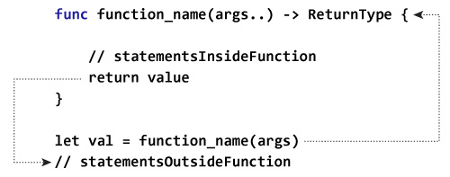

# 迅捷函数

> 原文： [https://www.programiz.com/swift-programming/functions](https://www.programiz.com/swift-programming/functions)

#### 在本文中，您将通过示例学习 Swift 中有关函数，什么是函数，语法，类型的所有知识。

## 什么是函数？

函数是一组定义要执行的动作的语句。 函数的主要用途是使代码可重用。

从技术上讲，您可以将函数视为机器。 机器执行特定任务，要求输入，处理输入并返回输出。

* * *

## 函数类型

取决于函数是预定义的还是由程序员创建的； 函数有两种类型：

1.  *库函数* - 在 Swift 框架中已经定义的函数。
2.  用户定义的函数 - 程序员自己创建的函数。

### 库函数

库函数是已在 Swift 框架中定义的内置函数。 这些函数可以解决 Swift 中的常见问题，因此您不必自己解决它们。 它们是简单的操作，例如打印，查找最小值和最大值等。

您可以通过调用（调用）库函数来直接使用它。 如果需要，可以查看 Swift 框架内的所有函数。 只需编写`import Swift`，按`Cmd`并单击它。 您将导航到新页面。 搜索以`func`关键字开头的所有语句。

#### 示例 1：库或内置函数

```swift
print("Hello, World!")
```

当您运行上述程序时，输出将是：

```swift
Hello, World!
```

在上面的程序中，我们调用了 Swift 框架中定义的内置`print`函数。 该函数用于在控制台中打印输出。

我们可以调用`print()`函数，因为 Swift 框架会自动导入到我们的游乐场中。 否则，我们应该自己编写`import Swift`来导入它。

* * *

### 用户定义的函数

Swift 还允许您定义自己的函数。 创建自己的函数有助于编写代码来解决问题或执行 Swift 框架中不可用的任务。 您还可以在将来重用您的函数来执行类似的任务。

* * *

同样，也可以根据参数和`return`语句对函数进行分类。 请参阅文章 [Swift 函数参数类型和返回类型](/swift-programming/function-parameter-return-values "Swift function parameter types and return types")。

* * *

## 定义函数

```swift
func function_name(args...) -> ReturnType {
    //statements
    return value
}

```

让我们简要描述每个组件：

*   `func`是创建函数必须编写的关键字
*   `function_name`是函数的名称。 您可以给它任何定义函数函数的名称。
*   `args…`定义函数接受的输入。
*   `->`该运算符用于指示函数的返回类型。
*   `ReturnType`定义可以从函数返回的值的类型。 例如。`Int`，`String`等
*   `return`关键字用于将程序的控制权转移到函数调用，并从函数返回值。
    即使您未指定`return`关键字，该函数也会在执行完最后一条语句后自动返回。
*   `value`表示从函数返回的实际数据。 值类型必须与`ReturnType`匹配。

* * *

## 函数如何工作？



在上图中，语句`function_name(args)`调用/调用带有参数值`args`的函数，然后该函数离开代码的当前部分（即停止执行其下面的语句）并开始执行内部的第一行 函数。

1.  程序进入代码`func function_name(Args...)`的行，并接受在函数调用`function_name(args)`期间传递的值`args`。
2.  然后程序执行函数内部定义的语句`statementsInsideFunction`。
3.  函数内部的语句按从上到下的顺序执行，一个接一个。
4.  执行完最后一条语句后，程序将离开函数并返回到从`function_name(args)`开始的位置。
5.  `let val =`将函数返回的值存储在常量`val`中。 同样，您可以将变量存储为`var val =`。
6.  之后，执行`statementsOutsideFunction`语句。

### 示例 2：如何在 Swift 中定义函数？

```swift
func greet(user:String) {
    print("Good Morning! \(user)")
} 
```

上面显示的是一个包含以下组件的函数定义：

1.  关键字`func`标记函数头的开始。
2.  `greet`是用于在程序中唯一标识和调用函数的函数名称。
3.  `(user:String)`标记函数头的结尾，并接受`String`类型的参数。 请参阅文章 [Swift 函数参数类型和返回类型](/swift-programming/function-parameter-return-values "Swift Function Parameter Types and Return Types")，它们使用参数定义函数。
4.  该函数由体内的`print`语句组成，该语句在调用该函数后执行。

* * *

## 调用函数

创建函数后，可以在程序中调用它以执行函数内部声明的语句。 要调用一个函数，您只需编写函数名称，后接`()`，然后将输入参数传递为：

```swift
greet(user: "Isac")
```

### 示例 3：在 Swift 中调用函数

```swift
func greet(user:String) {
    print("Good Morning! \(user)")
}

greet(user: "Isac") 
```

运行该程序时，输出为：

```swift
Good Morning! Isac
```

在上面的代码中，`greet(user: "Isac")`调用该函数并传递`String`类型的值`Isac`。 之后，将执行函数内的`print`语句。

* * *

## `return`语句

`return`关键字告诉程序退出函数并返回到进行函数调用的行。

您也可以使用`return`关键字传递值，其中`value`是变量或从函数返回的其他信息。

### 示例 3：带有`return`关键字的函数

```swift
func greet(user:String)-> String {
    return "Good Morning! \(user)"
}

let greeting = greet(user: "Isac")
print("""
     You have a new message
     \(greeting)
     """) 
```

运行该程序时，输出为：

```swift
You have a new message
Good Morning! Isac 
```

在上面的代码中，`greet(user: "Isac")`调用该函数并传递`String`类型的值`Isac`。`return "Good Morning! \(user)"`语句返回`String`类型的值，并将程序转移到函数调用中。

`let greeting =`存储从函数返回的值。 函数返回后，将执行函数调用下方的`print`语句。

* * *

## 要记住的事情

*   给出反映该函数用途的函数名称。
*   一个函数只能完成一项任务。 如果一个函数执行多个任务，请将其分解为多个函数。
*   尽早考虑并在使函数可重用和模块化的函数内部对语句进行分组。