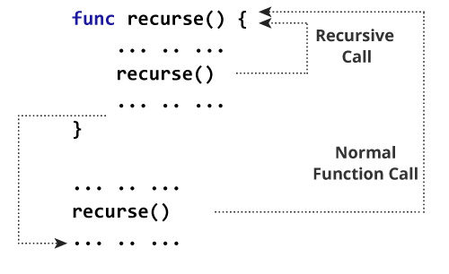
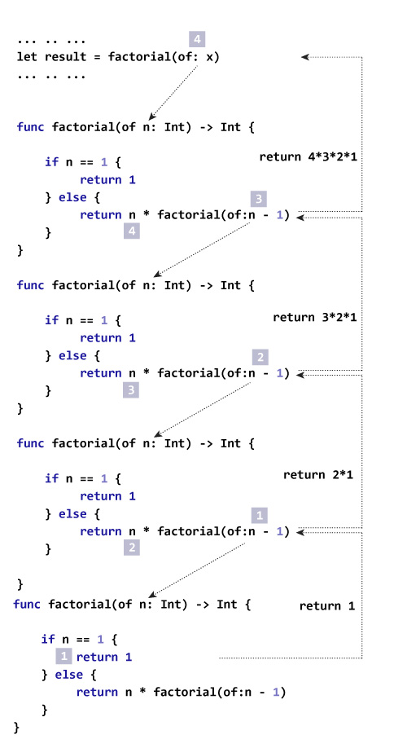

# 快速递归

> 原文： [https://www.programiz.com/swift-programming/recursion](https://www.programiz.com/swift-programming/recursion)

#### 在本文中，您将学习创建递归函数。 一个自我调用的函数。

调用自身的[函数](/swift-programming/functions "Swift functions")被称为递归函数。 并且，这种技术称为递归。 创建递归函数时，必须创建一个条件，以使函数不会无限期地（无限期地）调用自身。

## 递归在 Swift 中如何工作？

```swift
func recurse() {
    //statements
    recurse()
}
recurse()

```

下图显示了递归调用的方式。



在上面的流程图中，递归是无限执行的。 但是，几乎所有情况下，您都会创建一个递归，该递归将一直执行到满足某些条件为止。

为防止无限递归，请在 [Swift 条件语句](/swift-programming/expressions-statements-blocks#control-flow-statements "Swift control flow statements")中使用递归调用，例如 [if ... else 语句](/swift-programming/if-else-statement "Swift if-else statement")。

* * *

## 示例 1：打印 N 个正数

```swift
func countDownToZero(num: Int) {
    print(num)
    if num > 0 {
        countDownToZero(num: num - 1)
    }
}
print("Countdown:")
countDownToZero(num:3) 
```

当您运行以下程序时，输出将是：

```swift
Countdown:
3
2
1
0
```

在上述程序中，语句`print("Countdown:")`在控制台中输出 **Countdown：**。 语句`countDownToZero(num:3)`调用带有参数`Integer`的函数。

执行函数`countDownToZero()`内的语句，如果满足条件`num > 0`，则再次调用函数`countDownToZero()`作为`countDownToZero(num: num - 1)`。

如果不满足条件，则函数调用不会完成，并且递归会停止。

### 让我们逐步来看一下

Execution steps

| 脚步 | 函数调用 | 印制 | num > 0？ |
| --- | --- | --- | --- |
| 1 | `countDownToZero(3)` | **3** | 是 |
| 2 | `countDownToZero(2)` | **2** | Yes |
| 3 | `countDownToZero(1)` | **1** | Yes |
| 4 | `countDownToZero(0)` | **0** | 否（完） |

* * *

## 示例 2：查找数字的阶乘

```swift
func factorial(of num: Int) -> Int {
    if num == 1 {
        return 1
    } else {
        return num * factorial(of:num - 1)
    }
}

let x = 4
let result = factorial(of: x)
print("The factorial of \(x) is \(result)") 
```

When you run the following program, the output will be:

```swift
The factorial of 4 is 24
```

### 这个例子是如何工作的？



### Let's see this in steps

Execution steps

| Steps | 争论通过 | 退货声明 | 值 |
| --- | --- | --- | --- |
| 1 | 4 | `return 4 * factorial(of:3)` | **4 *阶乘（of：3）** |
| 2 | 3 | `return 3 * factorial(of:2)` | **4 * 3 *阶乘（of：2）** |
| 3 | 2 | `return 2 * factorial(of:1)` | **4 * 3 * 2 *阶乘（of：1）** |
| 4 | 1 | `return 1` | **4 * 3 * 2 * 1** |

当可以在大约两个步骤中找到问题的解决方案时，通常将递归用作迭代的替换。 如果没有重复该过程，则第一步将搜索解决方案。